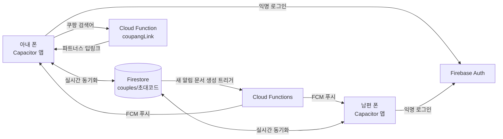

# [Phase] 부부 실사용 테스트 준비 (Real-Use Beta)

> 작성: 2026-09-28 · 상태: **구현 완료, 실사용 테스트 시작** (v0.0.14)
> 목표: 사용자 부부(2명)가 각자 폰에 설치해 **처음 쓰는 사용자처럼** 실제로 써보며 테스트한다. 정식 출시 전 한시적 구성.
> 관련 결정: ADR 32(최종 연동 단계), ADR 39(이 문서의 결정)

---

## 1. 범위

| # | 항목 | 이번 테스트에서 | 비고 |
|---|---|---|---|
| 1 | 쿠팡 생필품 장보기 | **사용자 본인 쿠팡 파트너스 계정**으로 연결 | 정식 출시 때 회사 계정으로 교체 |
| 2 | 포인트 | 정상 적립·저장·동기화 | **기프티콘 구매(교환)만 미구현** — 버튼은 "준비 중" 안내 |
| 3 | 부부 연동 | Firebase로 두 폰 실시간 동기화 + 서로 알림 | 앱이 꺼져 있어도 푸시(FCM, Blaze 요금제) |
| 4 | 초기 데이터 | 예시 할 일·퀘스트 진행도·포인트·통계·알림 **전부 초기화** | 신규 사용자 흐름으로 시작 |
| 5 | 배포 | 남편 폰 설치 방법 안내 | APK 설치 + 초대 코드 입력 |

제외: 기프티콘 실제 교환, 실제 앱 차단(ADR 32 유지), 광고 SDK(시뮬레이션 유지).

---

## 2. 아키텍처 (테스트용)

- **계정**: Firebase 익명 로그인(가입 절차 없음). 기기별 uid.
- **부부 연결**: 첫 사람이 `새 가족 만들기` → 초대 코드(예: `BBOMA-4827`) 생성, 역할(엄마/아빠) 선택. 배우자가 설치 후 `코드로 참여` → 남은 역할로 자동 배정.
- **데이터**: `couples/{코드}` 문서 하나에 공유 상태(할 일, 일정, 퀘스트, 페널티권, 포인트, 알림, 돛단배, 통계 로그 등)를 키별 필드로 저장. 변경된 키만 올림. 같은 키를 동시에 고치면 나중 저장이 이김(테스트 규모에서 허용).
- **보안 규칙**: 해당 가족 문서는 `members`에 등록된 uid만 읽기/쓰기. 참여는 코드를 아는 사람만, 최대 2명.
- **알림**: 기존 `sendSpouseNotification`이 상대 알림함에 쓰면 동기화로 상대 앱 알림 센터에 도착. 추가로 Cloud Function이 FCM으로 폰 상단 푸시 발송(앱 꺼져 있어도).
- **비밀값**: 저장소가 **공개(public)**이므로 쿠팡 Secret Key 등 비밀값은 코드·APK에 넣지 않고 Cloud Functions 비밀(Secret Manager)에만 저장. Firebase 웹 설정값(apiKey 등)은 공개돼도 되는 식별자이며 보안 규칙으로 보호.

---

## 3. 쿠팡 파트너스 연결 (한시적, 사용자 계정)

1. 쿠팡 파트너스(partners.coupang.com) 로그인 → **추가 기능 → 오픈 API**에서 `Access Key` / `Secret Key` 확인(발급 조건은 파트너스 정책에 따름).
2. 두 키는 채팅이나 코드에 붙이지 말고, 안내하는 명령으로 **Firebase 비밀값에 직접 입력**.
3. 앱에서 검색하면 Cloud Function이 파트너스 딥링크를 만들어 쿠팡 검색 결과로 이동(`subId`로 우리 앱 유입 구분).
4. 오픈 API가 아직 없으면: 파트너스 **링크 생성**으로 만든 단축 링크 1개(쿠팡 홈/검색)로 연결하고, 검색어는 쿠팡에서 다시 입력.

주의
- 쿠팡 파트너스 약관상 **본인·가족 구매는 수익으로 인정되지 않을 수 있음** — 테스트 중 실제 수수료 기대는 하지 않는다.
- 앱의 "2% 적립"은 **앱 포인트**. 실제 구매를 자동 확인하려면 파트너스 리포트 API(익일 집계)가 필요 → 이번 테스트는 쇼핑 후 돌아와 `구매했어요(금액)`로 기록하면 2% 적립(월 3,500P 한도).

---

## 4. 초기화 기준 (신규 사용자 상태)

- 할 일 0개, 일정 0개, 돛단배 0척, 알림 0개, 페널티권 0장, 방어권 0장, 쿠폰 0장
- 포인트 0P, 포인트 내역 없음, 가족 레벨 1 / EXP 0
- 퀘스트: 진행도 0, 처음 5개 공개 + 나머지 잠금, 맞춤 보상 미설정
- 통계: 빈 활동 로그(날짜별 기록으로 전환, 오늘 기준 7일·4주·6개월 자동 계산)
- 이름 미입력(엄마/아빠 표시), 온보딩 가이드 첫 실행
- **"오늘" 고정값(2026-09-24) 제거** → 실제 오늘 날짜 사용, 캘린더 주간도 실제 날짜 기준

---

## 5. 남편 폰 설치 & 연결

1. GitHub 릴리스의 최신 APK 링크를 남편 폰에서 열어 다운로드 → 설치(“출처를 알 수 없는 앱” 허용 필요).
2. 앱 실행 → `코드로 참여` → 아내 폰에 뜬 초대 코드 입력 → 자동으로 남은 역할(아빠) 배정.
3. 알림 권한 허용(푸시 수신용).
4. 두 폰 모두 인터넷 연결 필요. 이후 한쪽에서 한 일은 상대 폰에 바로 반영.

---

## 6. 체크리스트

- [x] 계획 문서 작성 (이 문서)
- [x] Firebase 프로젝트 `bbomakids-beta-21071` (Blaze) / Android·Web 앱 등록 / Firestore(asia-northeast3) / 익명 Auth
- [x] 앱: Firebase SDK 연결, 초대 코드 가족 만들기·참여, 역할별 화면
- [x] 앱: 공유 상태 동기화 + 로컬 저장(오프라인 대비)
- [x] 앱: 실제 날짜 기준 동작(오늘/캘린더/통계 로그)
- [x] 앱: 포인트 정상 적립·저장, 기프티콘 교환은 "준비 중"
- [x] 쿠팡 파트너스 딥링크 Cloud Function `coupangLink` (키 미입력 시 일반 검색)
- [x] FCM 푸시 Cloud Function `spousePush` + @capacitor/push-notifications
- [x] 예시 데이터 전부 초기화 (DB 테스트 가족 삭제, 앱 데이터 초기화)
- [x] 실기기 검증: 아내 폰(실기기) ↔ 남편(Firebase SDK 시뮬레이터) 양방향 동기화·알림, 앱 백그라운드 상태 FCM 푸시 수신
- [x] 결과 문서화 & 배포

---

## 7. 구현 결과 (2026-09-28)

| 구성 | 내용 |
|---|---|
| Firebase 프로젝트 | `bbomakids-beta-21071` (표시명 Bbomakids Beta, Blaze, 예산 알림 설정) |
| 인증 | 익명 로그인 (기기별 uid) |
| DB | Firestore `couples/{6자리코드}` — `members[]`, `roleUids{mom,dad}`, `tokens{mom,dad}`(FCM), `items.{목록}.{id}`(항목별 JSON), `counters.*`(증감 숫자), `state.{필드}`(통째 값), `updatedBy` — v2 형식(ADR 42), v1 문서는 자동 이관 |
| 보안 규칙 | `firestore.rules` — 멤버만 get/update, 목록 조회 금지, 참여는 members에 자기 uid 1개 추가만 허용(최대 4), 삭제 금지 |
| 서버 함수 | `functions/index.js` (Node 22, asia-northeast3): `spousePush`(가족 문서 변경 시 새 알림을 상대 FCM 토큰으로 발송, 채널 `spouse`), `coupangLink`(Secret `COUPANG_ACCESS_KEY/SECRET_KEY`로 파트너스 딥링크, 값이 `NONE`이면 일반 검색) |
| 앱 | 첫 화면 `새 가족 만들기 / 초대 코드로 참여하기`, 프로필에 가족 코드 + 공유 버튼, 연결 기기에서는 테스트용 화면 전환 버튼 숨김 |
| 알림 방향 | 연결된 기기에서 `sendSpouseNotification`은 항상 "이 폰 주인 → 배우자". 🏆 시스템 달성 알림은 양쪽 모두 |
| 초기 상태 | `applyFreshState()` + 데이터 버전 `beta1` 첫 실행 시 예전 로컬 데이터 정리 |

### 쿠팡 키 입력 (나중에 해도 됨)
Google Cloud 콘솔 → 보안 비밀 관리자(Secret Manager) → `COUPANG_ACCESS_KEY`, `COUPANG_SECRET_KEY` 각각 **새 버전 추가**로 실제 값 입력 → 앱 재배포 없이 `firebase deploy --only functions:coupangLink` 한 번 다시 배포.

### 배포 시 주의 (개발자용)
- 이 PC에서 `firebase deploy --only functions`가 코드 분석 단계에서 실패하면: `functions/functions.yaml`을 로컬 서버(`npx firebase-functions`)에서 받아 둔 상태로 배포한다(이미 저장됨, 함수 목록이 바뀌면 다시 생성).
- `google-services.json`은 git 제외 대상. 새 PC에서 빌드하려면 `firebase apps:sdkconfig ANDROID <appId> -o android/app/google-services.json`.

## 8. 사용 방법 (부부용 요약)

1. **아내 폰**: 새 버전 APK 설치 → 앱 실행 → `새 가족 만들기` → `엄마` 선택 → 6자리 코드가 나오면 `코드 보내기`로 카톡 전송 → `시작하기`.
2. **남편 폰**: 받은 링크로 APK 설치(“출처를 알 수 없는 앱” 허용) → 앱 실행 → `초대 코드로 참여하기` → 코드 입력 → 자동으로 `아빠` 연결 → 알림 권한 **허용**.
3. 둘 다 프로필(오른쪽 위 얼굴)에서 이름을 넣으면 "엄마/아빠" 대신 이름으로 보인다.
4. 이후 한쪽에서 할 일 추가·완료·도움 요청·고마워요·페널티·돛단배를 하면 상대 폰에 바로 반영되고, 앱이 꺼져 있으면 폰 상단 푸시가 온다.
5. 인터넷이 끊기면 폰에 저장해 두었다가 다시 연결되면 올린다.

## 9. 알려진 이슈 & 보류 (반드시 후속 처리)

- [x] **동시 수정 덮어쓰기** — v0.0.17(ADR 42)에서 해결: 목록은 항목 단위 병합, 숫자는 증감, 화면 보기만으로는 업로드 안 함, 할 일 ID 충돌 방지. 남은 한계: **같은 항목 하나**(예: 같은 할 일의 제목)를 두 폰이 동시에 고치면 여전히 나중 저장이 남음(드문 경우).
- [ ] **쿠팡 파트너스 연결 보류** — Open API 키는 누적 판매 15만원 이상일 때 발급. 대안: 파트너스 "링크 생성" 단축링크를 앱에 연결. 현재는 일반 쿠팡 검색 + 결제 금액 입력 시 2% 적립.
