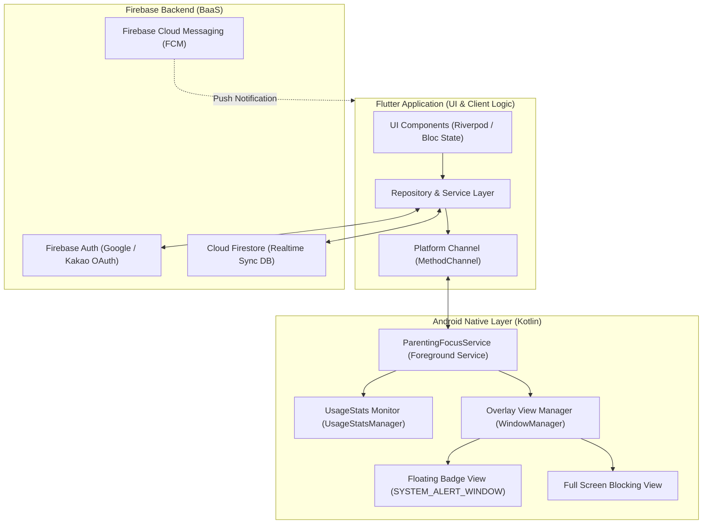

# [Living Spec] 시스템 아키텍처 & 네이티브 제어 규격서

> **문서 상태**: Active (SSOT)  
> **최종 갱신일**: 2026-09-24  
> **대상 시스템**: 클라이언트 아키텍처, Android OS 권한/서비스 제어, Firebase 백엔드 연동

---

## 1. 시스템 전체 아키텍처



---

## 2. 안드로이드 네이티브 제어 상세 규격

### 2.1 필수 권한 및 매니페스트 설정
```xml
<!-- AndroidManifest.xml 필수 권한 -->
<uses-permission android:name="android.permission.FOREGROUND_SERVICE" />
<uses-permission android:name="android.permission.FOREGROUND_SERVICE_SPECIAL_USE" />
<uses-permission android:name="android.permission.SYSTEM_ALERT_WINDOW" />
<uses-permission android:name="android.permission.PACKAGE_USAGE_STATS" tools:ignore="ProtectedPermissions" />
<uses-permission android:name="android.permission.POST_NOTIFICATIONS" />
<uses-permission android:name="android.permission.REQUEST_IGNORE_BATTERY_OPTIMIZATIONS" />
```

### 2.2 포그라운드 서비스 및 앱 감지 파이프라인
1. **서비스 시작**: 육아 집중 시간 시작 시 `ParentingFocusService.startService()` 호출.
   - 알림 표시줄(Notification Bar)에 "👶 육아 집중 시간 진행 중" 상주 알림 노출.
2. **앱 감지 루프 (`UsageStatsManager`)**:
   - `UsageStatsManager.queryEvents()`를 활용하여 최상단 액티비티 전환 이벤트(`UsageEvents.Event.ACTIVITY_RESUMED`) 감지 (500ms 주기).
3. **차단 및 오버레이 처리**:
   - 실행된 패키지가 차단 목록(`blockedPackages`)에 속한 경우:
     - `WindowManager.addView(blockingView, layoutParams)`로 화면 전체를 덮는 차단 뷰 표출.
     - `Intent.ACTION_MAIN + CATEGORY_HOME`을 발행하여 홈 화면으로 전환 유도.
   - 실행된 패키지가 허용 목록(`allowedPackages`)인 경우:
     - 차단 뷰를 제거하고, 화면 한구석에 `FloatingBadgeView` 유지.

### 2.3 플로팅 뱃지 오버레이 (`WindowManager.LayoutParams.TYPE_APPLICATION_OVERLAY`)
- **터치 이벤트**: `OnTouchListener`로 드래그 시 `layoutParams.x`, `layoutParams.y`를 실시간 갱신하여 화면 가장자리에 자연스럽게 부착(Magnetic Snap).
- **타이머 브로드캐스트**: 포그라운드 서비스의 1초 주기 틱(Tick)을 플로팅 뷰의 `TextView`에 바인딩.

---

## 3. Flutter - Native Platform Channel 인터페이스 규격

### MethodChannel: `com.weparent.app/native_focus`

| 메서드명 (`method`) | 매개변수 (`arguments`) | 반환값 (`result`) | 설명 |
|---|---|---|---|
| `checkPermissions` | - | `Map<String, Boolean>` | 오버레이 및 사용량 접근 권한 허용 여부 반환 |
| `requestOverlayPermission` | - | `Boolean` | '다른 앱 위에 표시' 설정 화면으로 이동 |
| `requestUsageStatsPermission` | - | `Boolean` | '사용 정보 접근' 설정 화면으로 이동 |
| `startFocusMode` | `{"durationSec": Int, "blockedList": List<String>}` | `Boolean` | 포그라운드 서비스 및 플로팅 뱃지 시작 |
| `stopFocusMode` | - | `Boolean` | 포그라운드 서비스 및 오버레이 해제 |
| `updateBlockedList` | `{"blockedList": List<String>}` | `Boolean` | 차단 앱 목록 실시간 동기화 |
