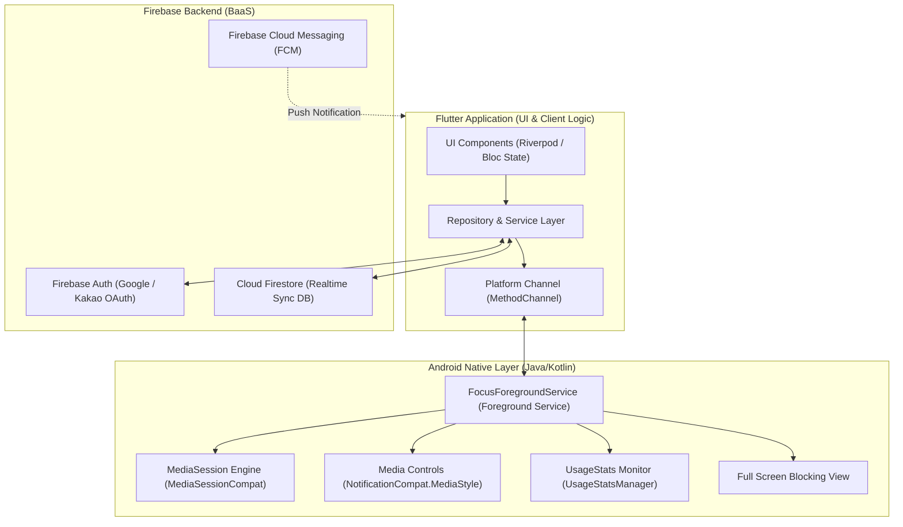
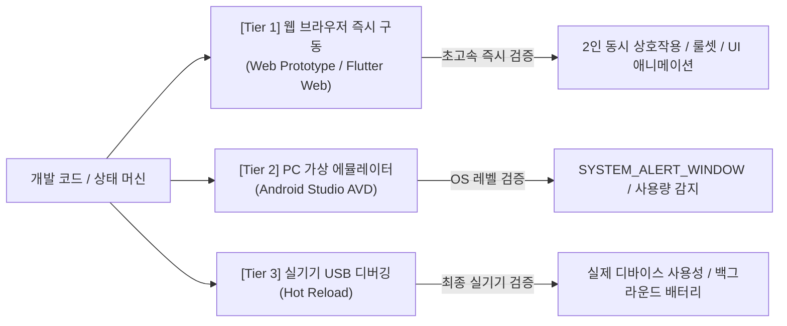

# [Living Spec] 시스템 아키텍처 & 네이티브 제어 규격서

> **문서 상태**: Active (SSOT)  
> **최종 갱신일**: 2026-09-24  
> **대상 시스템**: 클라이언트 아키텍처, Android OS 권한/서비스 제어, Firebase 백엔드 연동

---

## 1. 시스템 전체 아키텍처



---

## 2. 안드로이드 네이티브 제어 상세 규격

### 2.1 필수 권한 및 매니페스트 설정
```xml
<!-- AndroidManifest.xml 필수 권한 -->
<uses-permission android:name="android.permission.INTERNET" />
<uses-permission android:name="android.permission.POST_NOTIFICATIONS" />
<uses-permission android:name="android.permission.VIBRATE" />
<uses-permission android:name="android.permission.WAKE_LOCK" />
<uses-permission android:name="android.permission.FOREGROUND_SERVICE" />
<uses-permission android:name="android.permission.FOREGROUND_SERVICE_SPECIAL_USE" />
<!-- SYSTEM_ALERT_WINDOW 권한은 시스템 상태바 충돌 방지를 위해 완전 폐기됨 -->
```

### 2.2 포그라운드 서비스 및 미디어 파이프라인
1. **서비스 시작**: 육아 집중 시간 시작 시 `FocusForegroundService.startFocusTimer()` 호출.
   - 알림 채널 중요도 `IMPORTANCE_HIGH`를 통해 헤즈업 배너(Heads-up)를 즉시 표출하여 세션 시작 안내.
   - 상태바 알림 아이콘(`ic_stat_bboma`)이 Android SystemUI 표준 규칙에 따라 단독 슬롯에 상주.
2. **앱 감지 및 차단 루프 (`UsageStatsManager`)**:
   - `UsageStatsManager.queryEvents()`를 활용하여 최상단 액티비티 전환 이벤트(`UsageEvents.Event.ACTIVITY_RESUMED`) 감지 (500ms 주기).
   - 실행된 패키지가 차단 목록(`blockedPackages`)에 속한 경우 홈 화면 전환 유도 및 전체화면 차단 뷰 표출.

### 2.3 시스템 미디어 세션 & 미디어 컨트롤러 (`MediaSessionCompat` & `NotificationCompat.MediaStyle`)
1. **MediaSessionCompat 초기화 및 생명주기 관리**:
   - `MediaSessionCompat(context, "BbomaFocusMediaSession")` 인스턴스 생성.
   - 재생 제어 콜백(`onPlay`, `onPause`, `onFastForward`, `onStop`, `onCustomAction`) 구현.
   - 세션 활성화 플래그(`FLAG_HANDLES_MEDIA_BUTTONS | FLAG_HANDLES_TRANSPORT_CONTROLS`) 적용.
2. **3버튼 대화형 미디어 컨트롤러 (Media Controls)**:
   - `NotificationCompat.Action`:
     - **Action 0**: `ACTION_PAUSE` / `ACTION_RESUME` (계속 / 일시정지)
     - **Action 1**: `ACTION_EXTEND` (+5분 즉시 연장, `ic_media_ff`)
     - **Action 2**: `ACTION_STOP` (집중 종료, `ic_menu_close_clear_cancel`)
   - `MediaStyle.setShowActionsInCompactView(0, 1, 2)` 설정으로 알림 패널 축소 상태 및 잠금화면에서도 3대 액션 버튼 상시 노출.
3. **타임라인 프로그레스 및 메타데이터 바인딩**:
   - 매 초 타이머 틱(Tick)마다 `PlaybackStateCompat`의 상태(`STATE_PLAYING`/`STATE_PAUSED`), `position`, `speed`를 갱신.
   - `MediaMetadataCompat`에 트랙명(`👶 육아 집중 모드 (MM:SS)`), 서브타이틀(사용자 이름 및 역할), 총 집중 시간(`duration`)을 지속 업데이트하여 One UI 미디어 카드 시크바와 100% 호환.

---

## 3. Flutter - Native Platform Channel 인터페이스 규격

### MethodChannel: `com.weparent.app/native_focus`

| 메서드명 (`method`) | 매개변수 (`arguments`) | 반환값 (`result`) | 설명 |
|---|---|---|---|
| `checkPermissions` | - | `Map<String, Boolean>` | 오버레이 및 사용량 접근 권한 허용 여부 반환 |
| `requestOverlayPermission` | - | `Boolean` | '다른 앱 위에 표시' 설정 화면으로 이동 |
| `requestUsageStatsPermission` | - | `Boolean` | '사용 정보 접근' 설정 화면으로 이동 |
| `startFocusMode` | `{"durationSec": Int, "blockedList": List<String>}` | `Boolean` | 포그라운드 서비스 및 플로팅 뱃지 시작 |
| `stopFocusMode` | - | `Boolean` | 포그라운드 서비스 및 오버레이 해제 |
| `updateBlockedList` | `{"blockedList": List<String>}` | `Boolean` | 차단 앱 목록 실시간 동기화 |

---

## 4. 개발 검증 및 테스트 환경 규격 (Testing & Verification Strategy)

본 프로젝트는 불필요한 APK 수동 빌드/설치 오버헤드를 제거하고 이터레이션 속도를 극대화하기 위해 다계층 테스트 환경을 표준으로 규정한다.



### 4.1 Tier 1: 웹 브라우저 즉시 구동 (Primary Instant Verification) - 기본 표준
- **실행 방식**: `prototype/index.html` 단독 실행 또는 `python prototype/server.py` / `flutter run -d chrome` 구동.
- **주요 검증 영역**:
  - **부부 2인 동시 상호작용**: PC 한 화면에서 엄마(지은) 👩 와 아빠(민수) 👨 화면을 나란히 띄워 실시간 푸시, 할 일 완료 칭찬, 페널티 청구/방어 배틀 검증.
  - **게이미피케이션 상태 전이**: 이지 모드(30분 봐주기/유예) vs 하드 모드(즉시 페널티 자동 발급) 로직 실시간 검증.
  - **가상 OS 오버레이 시뮬레이션**: 딴짓 앱 실행 감지 및 차단 오버레이, 드래그 가능한 플로팅 뱃지 UI 시뮬레이션.
- **목적**: 설치 대기 시간 0초로 기획·UI·비즈니스 로직을 즉각 수정 및 검증.

### 4.2 Tier 2: PC 가상 안드로이드 에뮬레이터 (Native OS Verification)
- **실행 방식**: Android Studio AVD (Pixel / Galaxy 가상 기기) 실행 후 `flutter run`.
- **주요 검증 영역**: Kotlin MethodChannel 연동, `UsageStatsManager` 실제 폴링 주기, `WindowManager` 플로팅 오버레이 네이티브 렌더링.

### 4.3 Tier 3: 실기기 USB/무선 디버깅 (Device Hot Reload)
- **실행 방식**: 개발자 모드 활성화 스마트폰 연결 후 `flutter run` 실행 (APK 수동 복사/설치 불필요, `Ctrl+S` 시 0.5초 핫리로드).

