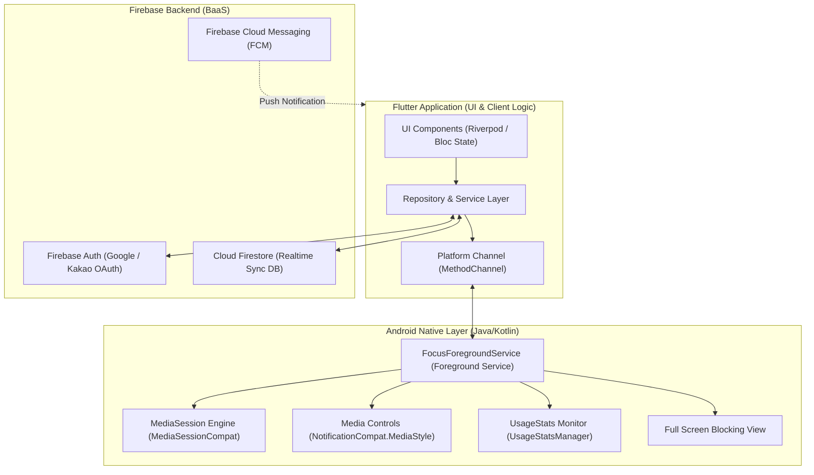
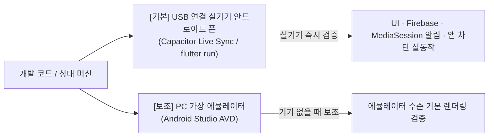

# [Living Spec] 시스템 아키텍처 & 네이티브 제어 규격서

> **문서 상태**: Active (SSOT)  
> **최종 갱신일**: 2026-09-24  
> **대상 시스템**: 클라이언트 아키텍처, Android OS 권한/서비스 제어, Firebase 백엔드 연동


> ⚠️ **현재 구현 상태 (2026-09-27)**: 데이터 계층은 기기 내 `STATE`뿐이며 Firebase(Auth/Firestore/FCM) 연동 코드는 없다. 부부 간 연동은 한 기기 시뮬레이션이다. 실제 앱 차단도 미구현. 두 작업은 디자인 완료 후 최종 연동 단계에서 일괄 진행한다 (ADR 32, [roadmap](../phases/roadmap.md)).

---

## 1. 시스템 전체 아키텍처


```mermaid
flowchart TB
    subgraph FlutterApp["Flutter Application (UI & Client Logic)"]
        UI_Layer["UI Components (Riverpod / Bloc State)"]
        Repo_Layer["Repository & Service Layer"]
        NativeBridge["Platform Channel (MethodChannel)"]
    end

    subgraph AndroidNative["Android Native Layer (Java/Kotlin)"]
        ForegroundService["FocusForegroundService (Foreground Service)"]
        MediaSessionEngine["MediaSession Engine (MediaSessionCompat)"]
        MediaControlsView["Media Controls (NotificationCompat.MediaStyle)"]
        UsageTracker["UsageStats Monitor (UsageStatsManager)"]
        BlockingView["Full Screen Blocking View"]
    end

    subgraph CloudServices["Firebase Backend (BaaS)"]
        FirebaseAuth["Firebase Auth (Google / Kakao OAuth)"]
        FirestoreDB["Cloud Firestore (Realtime Sync DB)"]
        CloudMessaging["Firebase Cloud Messaging (FCM)"]
    end

    UI_Layer --> Repo_Layer
    Repo_Layer <--> FirestoreDB
    Repo_Layer <--> FirebaseAuth
    Repo_Layer --> NativeBridge
    CloudMessaging -. Push Notification .-> FlutterApp

    NativeBridge <--> ForegroundService
    ForegroundService --> MediaSessionEngine
    ForegroundService --> MediaControlsView
    ForegroundService --> UsageTracker
    ForegroundService --> BlockingView
```

---

## 2. 안드로이드 네이티브 제어 상세 규격

### 2.1 필수 권한 및 매니페스트 설정
```xml
<!-- AndroidManifest.xml 필수 권한 -->
<uses-permission android:name="android.permission.INTERNET" />
<uses-permission android:name="android.permission.POST_NOTIFICATIONS" />
<uses-permission android:name="android.permission.VIBRATE" />
<uses-permission android:name="android.permission.WAKE_LOCK" />
<uses-permission android:name="android.permission.FOREGROUND_SERVICE" />
<uses-permission android:name="android.permission.FOREGROUND_SERVICE_SPECIAL_USE" />
<!-- SYSTEM_ALERT_WINDOW 권한은 시스템 상태바 충돌 방지를 위해 완전 폐기됨 -->
```

### 2.2 포그라운드 서비스 및 미디어 파이프라인
1. **서비스 시작**: 육아 집중 시간 시작 시 `FocusForegroundService.startFocusTimer()` 호출.
   - 알림 채널 중요도 `IMPORTANCE_HIGH`를 통해 헤즈업 배너(Heads-up)를 즉시 표출하여 세션 시작 안내.
   - 상태바 알림 아이콘(`ic_stat_bboma`)이 Android SystemUI 표준 규칙에 따라 단독 슬롯에 상주.
2. **앱 감지 및 차단 루프 (`UsageStatsManager`)** — **⚠️ 미구현 (최종 연동 단계 예정, ADR 32)**:
   - 현재 코드에는 감지/차단 로직과 권한(`PACKAGE_USAGE_STATS`, 접근성 서비스)이 없으며, 앱 내부 가상 홈 화면 시뮬레이션(`tryOpenApp`)만 존재.
   - 구현 계획: `UsageStatsManager.queryEvents()`로 최상단 액티비티 전환 이벤트(`UsageEvents.Event.ACTIVITY_RESUMED`) 감지 (500ms 주기).
   - 실행된 패키지가 차단 목록(`blockedPackages`)에 속한 경우 **접근성 서비스(`GLOBAL_ACTION_HOME`)로 홈 화면 이동** + "육아 집중 중" 안내 알림. 전체화면 오버레이는 ADR 21에 따라 사용 금지.

### 2.3 시스템 미디어 세션 & 미디어 컨트롤러 (`MediaSessionCompat` & `NotificationCompat.MediaStyle`)
1. **MediaSessionCompat 초기화 및 생명주기 관리**:
   - `MediaSessionCompat(context, "BbomaFocusMediaSession")` 인스턴스 생성.
   - 재생 제어 콜백(`onPlay`, `onPause`, `onFastForward`, `onStop`, `onCustomAction`) 구현.
   - 세션 활성화 플래그(`FLAG_HANDLES_MEDIA_BUTTONS | FLAG_HANDLES_TRANSPORT_CONTROLS`) 적용.
2. **3버튼 대화형 미디어 컨트롤러 (Media Controls)**:
   - `NotificationCompat.Action`:
     - **Action 0**: `ACTION_PAUSE` / `ACTION_RESUME` (계속 / 일시정지)
     - **Action 1**: `ACTION_EXTEND` (+5분 즉시 연장, `ic_media_ff`)
     - **Action 2**: `ACTION_STOP` (집중 종료, `ic_menu_close_clear_cancel`)
   - `MediaStyle.setShowActionsInCompactView(0, 1, 2)` 설정으로 알림 패널 축소 상태 및 잠금화면에서도 3대 액션 버튼 상시 노출.
3. **타임라인 프로그레스 및 메타데이터 바인딩**:
   - 매 초 타이머 틱(Tick)마다 `PlaybackStateCompat`의 상태(`STATE_PLAYING`/`STATE_PAUSED`), `position`, `speed`를 갱신.
   - `MediaMetadataCompat`에 트랙명(`👶 육아 집중 모드 (MM:SS)`), 서브타이틀(사용자 이름 및 역할), 총 집중 시간(`duration`)을 지속 업데이트하여 One UI 미디어 카드 시크바와 100% 호환.

---

## 3. Flutter & 하이브리드 - Native Bridge 인터페이스 규격

현재 하이브리드(Capacitor) 실측 구현 및 추후 Flutter 마이그레이션용 MethodChannel 인터페이스 규격:

### 3.1 Capacitor Plugin Bridge (`FocusServicePlugin.java`)

| 플러그인 메서드 (`PluginMethod`) | 매개변수 (`call.get*`) | 반환값 (`JSObject`) | 설명 |
|---|---|---|---|
| `startFocusService` | `secondsLeft: Int`<br/>`totalSeconds: Int`<br/>`userName: String`<br/>`userRole: String` | `{ success: Boolean, message: String }` | `POST_NOTIFICATIONS` 권한 검사 후 `FocusForegroundService` 포그라운드 시작 & `MediaSessionCompat` 미디어 알림 활성화 |
| `stopFocusService` | - | `{ success: Boolean, message: String }` | `FocusForegroundService.ACTION_STOP` 전송 및 서비스 종료 |

### 3.2 Flutter MethodChannel (`com.weparent.app/native_focus`) 매핑 규격

| 메서드명 (`method`) | 매개변수 (`arguments`) | 반환값 (`result`) | 설명 |
|---|---|---|---|
| `checkPermissions` | - | `Map<String, Boolean>` | 알림(`POST_NOTIFICATIONS`) 및 사용량 접근(`PACKAGE_USAGE_STATS`) 권한 상태 반환 |
| `requestUsageStatsPermission` | - | `Boolean` | Android '사용 정보 접근' 시스템 설정 화면으로 인텐트 이동 |
| `startFocusMode` | `{"secondsLeft": Int, "totalSeconds": Int, "userName": String, "userRole": String, "blockedList": List<String>}` | `Boolean` | 포그라운드 서비스 활성화, 시스템 미디어 세션 시작 및 상태바 `👶` 등록 |
| `stopFocusMode` | - | `Boolean` | 포그라운드 서비스 해제 및 미디어 세션 종료 |
| `updateBlockedList` | `{"blockedList": List<String>}` | `Boolean` | 차단 대상 패키지 목록 실시간 갱신 *(미구현 — 최종 연동 단계)* |

---

## 4. 개발 검증 및 테스트 환경 규격 (Testing & Verification Strategy)

모든 기능 검증은 **USB로 연결된 실제 안드로이드 폰 (Samsung Galaxy Z Flip 등)**을 기본 표준으로 한다. APK 수동 빌드/복사 없이 실시간 핫리로드로 즉각 반영하며, Android Studio Logcat과 디바이스 화면 캡처를 통해 네이티브 동작을 실시간 검증한다.


```mermaid
flowchart LR
    DevCode[개발 코드 / 상태 머신] --> DeviceTest["[기본] USB 연결 실기기 안드로이드 폰<br/>(Capacitor Live Sync / flutter run)"]
    DevCode --> AVDTest["[보조] PC 가상 에뮬레이터<br/>(Android Studio AVD)"]

    DeviceTest -->|실기기 즉시 검증| V1[UI · Firebase · MediaSession 알림 · 앱 차단 실동작]
    AVDTest -->|기기 없을 때 보조| V2[에뮬레이터 수준 기본 렌더링 검증]
```

### 4.1 기본 표준: USB 연결 실기기 (Device Hot Reload & Live Sync)
- **실행 방식**: 개발자 모드 및 USB 디버깅이 활성화된 안드로이드 실기기를 연결하여 즉시 실행.
- **주요 검증 영역**:
  - Phase 1: 화이트/네이비 듀얼 테마 UI 레이아웃, 밀어서 완료 스와이프 제스처, 대신 돕기, 부부 2인 상호작용
  - Phase 2: 안드로이드 공식 `MediaSessionCompat` 미디어 컨트롤러(일시정지 `⏸`, +5분 `⏩`, 종료 `✕`), `UsageStatsManager` 앱 차단 실동작, 백그라운드 포그라운드 서비스
  - Phase 3: 토스풍 퀘스트/치킨 저금통, 쿠팡 2% 캐시백, 10섹터 룰렛, 스마트 넛지 알림 동작
- **실기기 테스트 원칙**:
  - 오버레이 윈도우(`TYPE_APPLICATION_OVERLAY`)는 시스템 상태바 충돌로 영구 폐기되었으므로(ADR 21), 잠금화면 및 알림바의 시스템 미디어 카드로만 백그라운드 제어를 검증함.

### 4.2 보조 수단: PC 가상 안드로이드 에뮬레이터 (Android Studio AVD)
- **사용 시점**: 실기기를 연결할 수 없는 개발 환경에서 한시적으로 보조 검증용으로 사용.
- **한계**: 시스템 미디어 세션 확장 컨트롤 및 백그라운드 배터리 최적화 예외 처리는 실기기에서만 신뢰성 있게 검증 가능.


