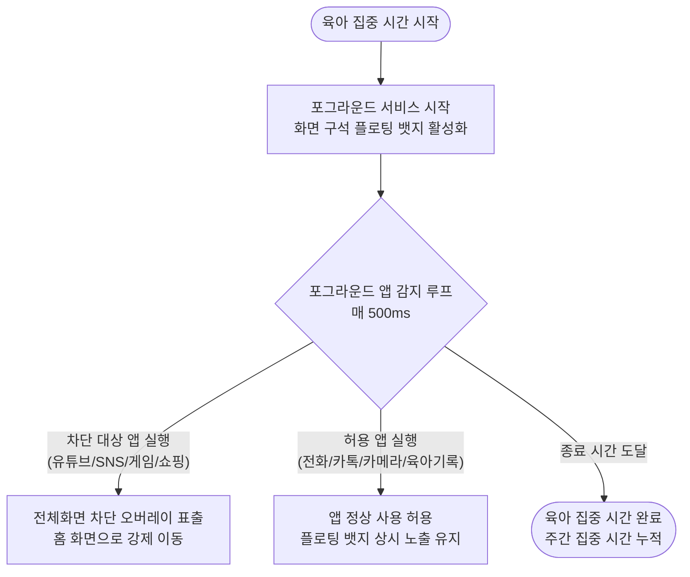

# [Living Spec] 핵심 비즈니스 & 게이미피케이션 시스템 규격서

> **문서 상태**: Active (SSOT)  
> **최종 갱신일**: 2026-09-24  
> **대상 시스템**: 모드, 육아집중타이머, 앱 차단, 할 일, 페널티권, 퀘스트/아이템 시스템

---

## 1. 개요 및 설계 원칙
- **단일 책임(SRP)**: 부부 간 잔소리와 감정 소모를 제거하고, 명확한 규칙과 유쾌한 게이미피케이션(상호 보상/방어)으로 협력 육아를 유도한다.
- **감정 안전장치 (Safety First)**: 비합리적인 벌칙이나 감정 싸움을 방지하기 위해 '합의된 룰셋'과 '이지/하드 모드', '방어 아이템'을 기본 탑재한다.

---

## 2. 모드 시스템 (Operation Modes)

온보딩 시 부부의 상호 합의로 난이도 모드를 설정하며, 언제든 설정에서 변경 가능하다.

| 구분 | 이지 모드 (Easy Mode) - 기본값 | 하드 모드 (Hard Mode) |
|---|---|---|
| **컨셉** | 상호 배려 및 유예형 | 칼같은 자동 집행형 |
| **마감 초과 시 동작** | 상대방에게 "미완료 확인" 알림 발송 | 마감 1분 초과 시 시스템이 즉시 페널티권 발급 |
| **유예 기능** | 30분 연장 또는 사유 인정(봐주기) 가능 | 유예 불가 (시스템 자동 처리) |
| **추천 대상** | 신생아/영아 육아로 돌발 상황이 잦은 부부 | 명확한 시간 분담과 자율 통제를 원하는 부부 |

---

## 3. 육아 집중 시간 & 스마트폰 제어 사양

### 3.1 앱 필터링 정책
1. **차단 앱 (Default Blocked)**:
   - 유튜브, 넷플릭스, 인스타그램, 틱톡, 웹툰, 모바일 게임, 쇼핑 앱 등 엔터테인먼트 계열
   - 사용자가 직접 차단 목록에 앱을 추가/제외 가능
2. **허용 앱 (Default Allowed)**:
   - 전화(기본 다이얼러), 긴급 메시지, 카카오톡, 카메라, 갤러리, 육아 기록 앱(베이비타임 등)

### 3.2 플로팅 상기 뱃지 (Floating Reminder Badge)
- **목적**: 허용 앱(카톡, 카메라 등)을 쓰는 중에도 '육아 중'임을 무의식적으로 인지시켜 딴짓으로 새는 것을 방지.
- **표시 형태**: 둥근 캡슐형 오버레이 (`👶 육아 집중 01:23:45`)
- **인터랙션**:
  - **Free Drag**: 사용자가 원하는 화면 위치(상하좌우 모서리)로 자유롭게 드래그 이동.
  - **Tap Action**: 탭 시 현재 남은 육아 시간 및 오늘의 할 일 요약 팝업 표시.

---

## 4. 할 일 관리 & 페널티권 라이프사이클

### 4.1 오늘의 할 일 (Daily Tasks)
- **등록**: 루틴 할 일(매일 반복: 목욕, 설거지, 분리수거 등) + 일회성 할 일
- **마감 시간(Deadline)**: 각 할 일마다 명확한 마감 시간 지정 (예: 20:00)
- **완료 체크**: 수행자가 완료 체크 시 상대방에게 칭찬 알림 발송.

### 4.2 페널티권 메커니즘
- **지급 조건**: 할 일 미완료 확정 시(이지모드: 상대방 확인 / 하드모드: 마감 초과 즉시) 상대방에게 **페널티권 1장** 지급.
- **페널티 룰셋 구조**:
  1. **싸움 방지 안전 템플릿 (Safe Preset)**:
     - `[가사 넘기기]`: 오늘 내 할 일 중 1개를 상대방에게 이관
     - `[추가 폰 차단]`: 상대방 스마트폰 딴짓 앱 1시간 추가 차단
     - `[다음 전담권]`: 다음 목욕/등하원/재우기 1회 단독 전담
     - `[힐링 벌칙]`: 15분 어깨 마사지해주기 / 커피/간식 사오기
  2. **부부 커스텀 룰 (Custom Rules)**:
     - 자유롭게 새 벌칙을 등록할 수 있으나, **양측 모두 '동의' 완료된 항목만** 선택 목록에 활성화.

---

## 5. 게이미피케이션 & 방어 퀘스트 시스템

일방적인 벌칙이 아닌 긍정적 협력 동기를 부여하기 위한 퀘스트 및 아이템 보상 시스템.

### 5.1 협력 퀘스트 명세
| 퀘스트 ID | 퀘스트 명 | 달성 조건 | 보상 |
|---|---|---|---|
| `Q_STREAK_7` | **7일 연속 육아 완주** | 부부 모두 7일 연속 육아 집중 시간 완료 | `페널티 면제권` 1장 |
| `Q_FOCUS_20H` | **노폰(No-Phone) 집중 주간** | 주간 합산 휴대폰 미사용 육아 20시간 달성 | `데이트/외식 쿠폰` 1장 |
| `Q_HELP_5` | **천사 배우자** | 상대방 할 일 대신 도와주기 5회 | `자유시간 2시간권` 1장 |

### 5.2 아이템 인벤토리 및 사용 규격
- **`페널티 면제권`**:
  - 상대방이 페널티권을 행사하려 할 때 "🛡️ 방어권 발동!"을 선택하여 페널티를 무효화(소모성).
- **`데이트/외식 쿠폰` / `자유시간 쿠폰`**:
  - 부부 공유 피드에 쿠폰 사용 선언 시 주말 외식 또는 2시간 육아 프리 타임 공식 인정.
