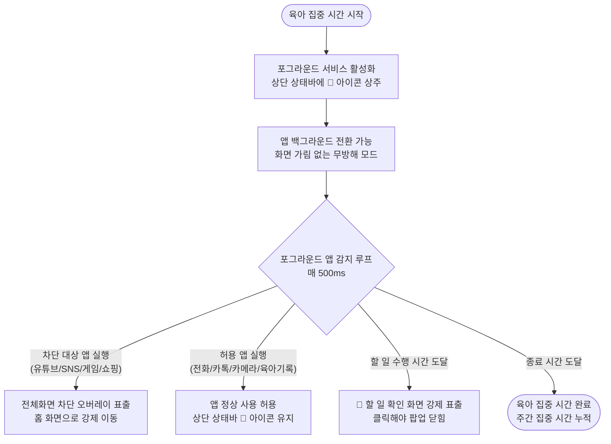
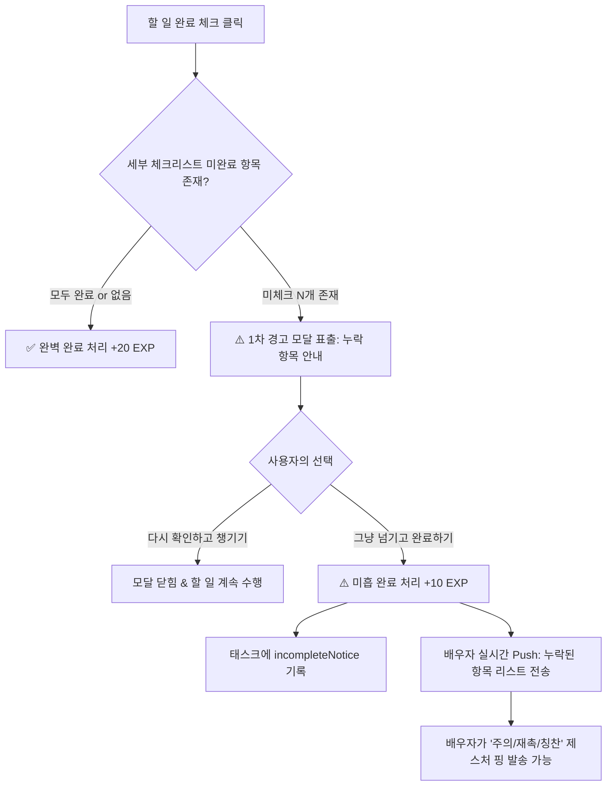
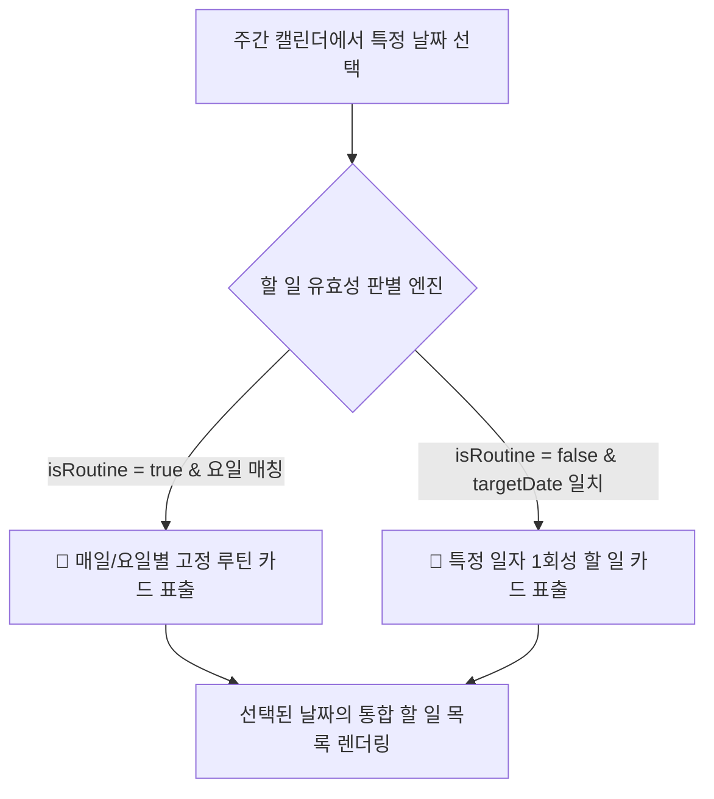
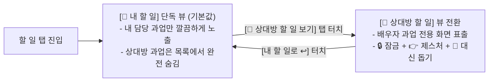
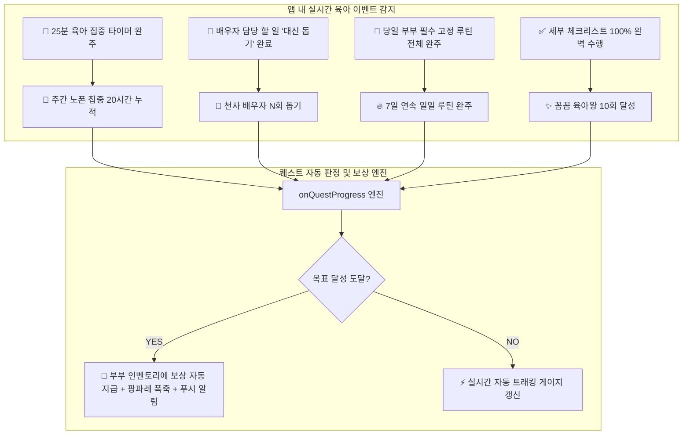
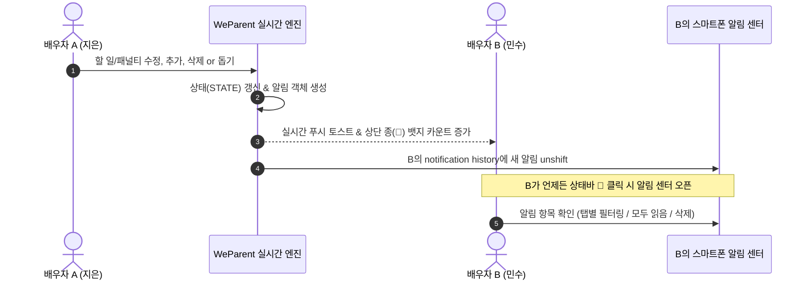
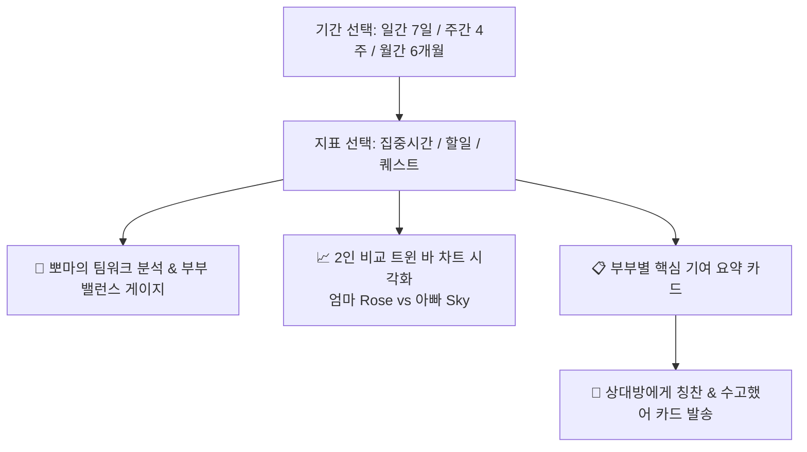

# [Living Spec] 핵심 비즈니스 & 게이미피케이션 시스템 규격서

> **문서 상태**: Active (SSOT)  
> **최종 갱신일**: 2026-09-24  
> **대상 시스템**: 모드, 육아집중타이머, 앱 차단, 할 일, 페널티권, 퀘스트/아이템 시스템

---

## 1. 개요 및 설계 원칙
- **단일 책임(SRP)**: 부부 간 잔소리와 감정 소모를 제거하고, 명확한 규칙과 유쾌한 게이미피케이션(상호 보상/방어)으로 협력 육아를 유도한다.
- **감정 안전장치 (Safety First)**: 비합리적인 벌칙이나 감정 싸움을 방지하기 위해 '합의된 룰셋'과 '이지/하드 모드', '방어 아이템'을 기본 탑재한다.

---

## 2. 모드 시스템 (Operation Modes)

온보딩 시 부부의 상호 합의로 난이도 모드를 설정하며, 언제든 설정에서 변경 가능하다.

| 구분 | 이지 모드 (Easy Mode) - 기본값 | 하드 모드 (Hard Mode) |
|---|---|---|
| **컨셉** | 상호 배려 및 유예형 | 칼같은 자동 집행형 |
| **마감 초과 시 동작** | 상대방에게 "미완료 확인" 알림 발송 | 마감 1분 초과 시 시스템이 즉시 페널티권 발급 |
| **유예 기능** | 30분 연장 또는 사유 인정(봐주기) 가능 | 유예 불가 (시스템 자동 처리) |
| **추천 대상** | 신생아/영아 육아로 돌발 상황이 잦은 부부 | 명확한 시간 분담과 자율 통제를 원하는 부부 |

---

## 3. 육아 집중 시간 & 스마트폰 제어 사양



### 3.1 안드로이드 공식 미디어 알림(Media Notification) & 미디어 컨트롤러(Media Controls) 규격
- **설계 의도**: 사용자가 육아에 집중하는 동안 스마트폰 화면에 거추장스러운 오버레이 위젯을 띄우지 않고, 유튜브/음악 스트리밍 앱처럼 안드로이드 OS가 공식 지원하는 **시스템 미디어 플레이어 세션(`MediaSessionCompat` + `NotificationCompat.MediaStyle`)**을 통해 백그라운드에서 직관적으로 상태를 인지하고 제어하도록 한다.
- **핵심 UX 및 동작 사양**:
  1. **헤즈업 알림 (Heads-up Alert)**:
     - "육아 집중 시작하기" 버튼을 누르는 즉시 상단에 슬라이드 다운 헤즈업 배너가 표출되어 모드 활성화를 직관적으로 알림.
     - 채널 중요도 `IMPORTANCE_HIGH` 설정으로 소리 없이 상단 배너 및 상태바 우선순위 확보.
  2. **시스템 상태바 단독 상주 (Status Bar Slot)**:
     - 화면 위에 억지로 띄우는 가짜 오버레이 윈도우(`TYPE_APPLICATION_OVERLAY`)를 전면 배제.
     - Android SystemUI의 표준 슬롯 규칙에 맞춰 상태바에 `ic_stat_bboma` (`👶`) 아이콘이 타 시스템 아이콘과 겹침 없이 깔끔하게 배치.
  3. **3버튼 인터랙티브 미디어 컨트롤러 (Media Controls)**:
     - 상단 알림 패널 및 잠금 화면(Lock Screen)의 최상단 미디어 캐러셀에 전용 플레이어 카드가 생성됨.
     - 컴팩트 뷰(`setShowActionsInCompactView(0, 1, 2)`)를 적용하여 알림창이 접힌 상태에서도 3대 액션이 상시 노출:
       - **`⏸` 일시정지 / `▶` 계속하기**: 앱에 진입하지 않고 알림바에서 즉시 타이머 일시정지(`PlaybackStateCompat.STATE_PAUSED`) 및 재개(`STATE_PLAYING`).
       - **`⏩` +5분 연장**: 터치 한 번으로 현재 집중 타이머에 5분(300초)을 즉시 가산.
       - **`✕` 집중 종료**: 원클릭으로 육아 집중 세션을 즉시 종료 및 포그라운드 서비스 해제.
  4. **실시간 재생 상태(PlaybackState) & 타임라인 동기화**:
     - `MediaSessionCompat`에 잔여 시간 및 전체 시간을 `MediaMetadataCompat.METADATA_KEY_DURATION` 및 `position`으로 지속 동기화하여 Android 13/14 퀵세팅 미디어 카드의 물결 타임라인 바와 완벽 호환.

### 3.2 유연한 집중 시간 설정 시스템 (Dual-Mode Duration Engine)

부모의 다양한 육아 스케줄에 맞춰 **간편 분 단위 설정**과 **세세한 시간대 구간 지정**의 2가지 방식을 직관적인 UI로 제공한다.

```mermaid
flowchart TD
    ModeSelect{집중 설정 모드 선택}
    ModeSelect -- ⚡ 간편 분 단위 --> Preset[15/25/30/50/60/120분 원터치 칩<br/>+ 5분/10분 단위 스텝퍼 미세조정]
    ModeSelect -- ⏰ 시간대 직접 지정 --> Range[시작-종료 Time Picker<br/>13:30 ~ 18:30 (총 5시간)<br/>+ 낮/오전/저녁/심야 4대 프리셋]
    
    Preset --> Start([👶 집중 시작하기 버튼])
    Range --> Start
    Start --> Service[포그라운드 서비스 활성화 & 카운트다운]
    Service --> Complete[완주 시 실제 시간(h 단위) 주간 퀘스트에 정밀 누적 & EXP 비례 지급]
```

1. **⚡ 간편 분 단위 모드 (Quick Presets & Stepper)**:
   - **6대 퀵 칩**: `15분`, `25분` (뽀모도로 기본), `30분`, `50분`, `60분 (1시간)`, `120분 (2시간)` 원터치 선택.
   - **스텝퍼 미세 조정**: `[-10분]`, `[-5분]`, `[+5분]`, `[+10분]` 버튼으로 원하는 시간 세밀 조율.
   - **종료 예상 시각 안내**: *"지금 시작 시 약 14:25까지 집중"* 실시간 프리뷰.
2. **⏰ 세세한 시간대 직접 지정 모드 (Custom Start~End Time Range)**:
   - **Time Picker 직접 입력**: `[13:30]` ~ `[18:30]`처럼 시작과 종료 시간을 분 단위로 세세하게 지정.
   - **총 집중 시간 자동 환산**: 자정(00:00) 넘김을 자동 지원하며 `총 5시간 0분 (300분)` 등 총 소요 시간 자동 계산.
   - **4대 상황별 시간대 프리셋**:
     - ☀️ `낮 집중` (13:30 ~ 18:30, 5시간)
     - 🌅 `오전 케어` (09:00 ~ 12:00, 3시간)
     - 🌙 `저녁 육아` (19:00 ~ 22:00, 3시간)
     - 🍼 `심야 케어` (22:00 ~ 02:00, 4시간)
3. **완주 보상 및 주간 퀘스트 비례 연동**:
   - 완주 시 실제 소요된 시간(`hours = totalSeconds / 3600`)이 공식 퀘스트 **`[📵 주간 노폰 집중 20시간 달성]`**에 자동 가산.
   - 경험치(EXP) 역시 집중 시간에 비례하여 동적 차등 지급 (예: 25분 완주 시 +50 EXP, 5시간 완주 시 +300 EXP).

### 3.3 앱 필터링 관리 및 진입 경로 (App Filter Manager UI)

#### 1) 진입 경로 (Entry Point)
- **1차 진입**: **`[육아 집중]` 메인 탭** 상단의 **`[⚙️ 차단 앱 관리]`** 버튼을 터치하여 즉시 진입.
- **2차 진입**: **`[설정]`** > **`[스마트폰 제어 & 차단 앱 목록]`** 메뉴.
- **온보딩 진입**: 최초 부부 온보딩 완료 시 '차단할 앱 추천 프리셋 선택' 단계 제공.

#### 2) 필터링 관리 화면 사양
- **카테고리별 스마트 토글 (Category Smart Toggle)**:
  - **🚨 딴짓 & 엔터테인먼트 (기본 차단 ON)**:
    - YouTube, Netflix, Instagram, TikTok, 웹툰, 모바일 게임, 쿠팡/쇼핑 등
  - **💬 필수 연락 & 도구 (기본 허용 / 차단 가능)**:
    - 카카오톡, 카메라, 포토 갤러리 등
  - **🔒 절대 차단 불가 (Locked Safe Apps)**:
    - 전화(기본 다이얼러), 긴급 메시지, 112/119, 육아 기록 필수 앱(베이비타임 등)
- **실시간 플랫폼 채널 연동**:
  - 토글 저장 시 `MethodChannel('native_focus').invokeMethod('updateBlockedList', blockedPackages)`로 네이티브 포그라운드 서비스에 즉시 동기화.

---

## 4. 할 일 관리 & 페널티권 라이프사이클

### 4.1 할 일 마감 & 강제 확인 팝업 (Mandatory Task Pop-up Overlay)
- **등록**: 루틴 할 일(목욕, 설거지, 분리수거 등) + 일회성 할 일 및 수행 마감 시간 지정.
- **수행 시간 인터럽트 팝업 (Screen Pop-up)**:
  - 지정된 할 일 시간/마감 시간이 되면 스마트폰 사용 중(또는 화면 켬 시) **화면 위에 강제로 할 일 확인 팝업(오버레이)** 표출.
  - **팝업 선택 옵션 (3단계)**:
    1. `[✅ 네, 완료했어요!]` : 할 일 완료 처리, 캐릭터 EXP +20 획득, 배우자에게 칭찬 푸시 발송 및 팝업 닫힘.
    2. `[⏳ 15분 뒤 알림]` : 15분 후 다시 전체 화면 알림 예약 및 팝업 닫힘.
    3. `[📋 오늘 할 일 리스트 확인하기]` (하단 서브 텍스트) : 팝업을 닫고 오늘의 할 일 전체 목록 화면으로 즉시 이동하여 남은 일정 검토.
  - 팝업을 무시하고 뒤로가기할 수 없도록 하여 실제 행동을 이끌어내고 깜빡 잊는 것을 방지.
- **완료 체크**: 수행자가 완료 확인 시 상대방에게 칭찬 푸시 알림 발송.

### 4.2 페널티권 메커니즘 & 특별 페널티 과업 연동 (Penalty Lifecycle & Auto-Todo Integration)

- **지급 조건**: 할 일 미완료 확정 시(이지모드: 상대방 확인 / 하드모드: 마감 초과 즉시) 상대방에게 **페널티권 1장** 지급.
- **페널티 룰셋 구조**:
  1. **싸움 방지 안전 템플릿 (Safe Preset)**:
     - `[가사 넘기기]`: 오늘 내 할 일 중 1개를 상대방에게 이관
     - `[추가 폰 차단]`: 상대방 스마트폰 딴짓 앱 1시간 추가 차단
     - `[다음 전담권]`: 다음 목욕/등하원/재우기 1회 단독 전담
     - `[힐링 벌칙]`: 15분 어깨 마사지해주기 / 커피/간식 사오기
  2. **부부 커스텀 룰 (Custom Rules)**:
     - 자유롭게 새 벌칙을 등록할 수 있으나, **양측 모두 '동의' 완료된 항목만** 선택 목록에 활성화.
- **페널티권 사용 및 수락/방어 라이프사이클 (Penalty Attack & Defense Lifecycle)**:
  1. **1단계: 페널티권 사용 확인 다이얼로그 (Penalty Use Confirmation Dialog)**:
     - 페널티 카드에서 `[사용하기 ⚡]` 클릭 시 **`"상대방의 할 일에 추가하시겠습니까?"`** 선택 팝업 표출.
     - **선택 옵션**:
       - `[✨ 네, 상대방 할 일로 발동할게요!]` (`addToTodo: true`): 상대방이 수락할 경우 오늘 할 일 목록에 특별 페널티 과업으로 자동 등록하도록 공격 전송.
       - `[💬 아니오, 일반 벌칙으로 발동할게요]` (`addToTodo: false`): 할 일 목록에는 추가하지 않고 일반 벌칙 공격으로 전송.
       - `[사용 취소]`: 페널티권을 차감하지 않고 인벤토리에 보존.
  2. **2단계: 상대방의 수락 / 방어권 발동 인터랙션 (Incoming Penalty Alert & Defense)**:
     - 페널티 공격을 받은 배우자의 화면 상단에 **`[⚡ 배우자의 페널티권 공격!]`** 대형 배너가 최우선 표출됨.
     - **선택지**:
       - **`[🫡 벌칙 수락 (할 일에 추가)]`** (할 일 연동 시):
         - 오늘 할 일 목록(`STATE.tasks`)에 **`isPenaltyTask: true`** 속성의 **핑크빛 특별 페널티 과업**으로 자동 등록.
         - **제약 사양**: 세부 체크리스트(`subtasks: []`)는 해당 없음(생략 처리).
         - **UI 강조 효과**: 핑크/네온 테두리 반짝임 애니메이션(`animate-pink-glow`, `shadow-[0_0_20px_rgba(244,63,94,0.45)]`), 상단 `[⚡ 특별 페널티 과업]` 전용 뱃지 표출.
         - 자동으로 배우자의 탭을 `[📋 할 일]`로 전환하여 등록된 과업을 즉시 인지시킴.
       - **`[🛡️ 방어권 발동 (면제권 사용)]`** (보유 면제권 있을 시):
          - 면제권 1장을 소모하여 벌칙을 즉시 **완벽 무효화** (할 일 목록에 등록되지 않음).
          - **페널티권 복구 & 48시간 쿨타임 (48h Cooldown Recovery)**:
            - 공격자가 사용했던 페널티권은 **영구 삭제되지 않고 인벤토리로 복구**됨.
            - 단, **48시간 동안 재사용 잠금(쿨타임)**이 적용되어 사용 버튼이 비활성화되며 `[⏳ 48시간 쿨타임 (방어로 튕겨남)]` 상태로 전환됨.
          - 방어 성공 축하 꽃가루 효과 및 상대방에게 *"🛡️ 배우자가 방어권을 사용하여 [벌칙명] 부과에 실패했습니다! (페널티권 48시간 잠금 복구)"* 알림 전송.
  3. **3단계: 특별 페널티 과업 수행 완료 (Completion)**:
     - 배우자가 해당 특별 페널티 과업을 성실히 수행 후 완료 체크 시, `+25 EXP` 및 축하 꽃가루 효과와 함께 상대방에게 *"🎉 배우자가 특별 페널티 과업을 성실히 완수했습니다!"* 격려 푸시 알림 발송.

### 4.3 가사 & 육아 할 일 관리 (Task CRUD Engine)

부부는 일상의 육아/가사 분담 항목을 언제든 추가, 수정, 삭제할 수 있으며, 변경 사항은 상대방에게 실시간 알림으로 즉각 전달된다.

- **할 일 추가 (Create)**:
  - 할 일 제목, 담당자(엄마/아빠), 수행 마감 시간(예: 20:00) 지정.
  - **빠른 추천 프리셋 (One-Click Presets)**:
    - 🛁 `아기 목욕시키기 & 보습제 바르기` (20:00)
    - 🍼 `저녁 설거지 & 젖병 열탕 소독` (21:00)
    - 🧸 `거실 장난감 정리 & 교구 소독` (21:30)
    - 🧺 `아기 옷 빨래 & 건조기 돌리기` (19:30)
    - 🍲 `내일 이유식 & 간식 준비하기` (22:00)
    - 🗑️ `기저귀 쓰레기 배출 & 분리수거` (22:30)
- **할 일 수정 (Update)**:
  - 기존 등록된 할 일의 명칭, 담당자, 마감 시간 및 세부 체크리스트 항목 변경 지원.
- **할 일 삭제 (Delete)**:
  - 불필요하거나 일정이 변경된 할 일 항목 즉시 제거.

### 4.4 세부 체크리스트 (Sub-Checklist) & 미완료 제출 시 2단계 확인 플로우

가사/육아의 세세한 디테일까지 완벽하게 수행할 수 있도록, 할 일 등록/수정 시 **선택적 세부 체크리스트(Sub-Checklist)** 기능을 지원하며, 미완료 항목이 있는 상태에서 완료 시도 시 경고 및 상호 공유 메커니즘을 제공한다.



#### 4.4.1 세부 체크리스트 생성 및 프리셋 연동
* **사용자 자유 추가**: 할 일 제목 외에 `[+ 세부 체크리스트 추가]` 버튼을 통해 원하는 세부 점검 항목을 N개 등록 가능 (예: *"머리 꼼꼼히 말리기"*, *"잠옷 입히기"* 등).
* **6대 프리셋 자동 주입**:
  * 🛁 `아기 목욕`: 욕실 온도 체크 & 물 맞추기, 머리 구석구석 말리기, 보습제 바르고 잠옷 입히기, 욕실 바닥 물기 닦기
  * 🍼 `젖병 열탕 소독`: 기름때 애벌 설거지, 젖병 세정 & 열탕 소독기 가동, 싱크대 거름망 비우기
  * 🧸 `장난감 정리`: 매트 위 장난감 바구니 분류, 아기 교구 소독티슈 닦기, 바닥 청소기 돌리기
  * 🧺 `아기 빨래`: 아기 전용 세제 세탁, 건조기 안심 모드 가동, 개어서 서랍장 정리
  * 🍲 `이유식 준비`: 이유식 큐브 소분 & 냉장 해동, 내일 간식 챙기기, 식기 열탕 소독
  * 🗑️ `기저귀/분리수거`: 매직캔 종량제 봉투 묶기, 재활용 분리수거, 현관 앞 배출

#### 4.4.2 미완료 체크리스트 제출 시 2단계 경고 및 확인 플로우
1. **1차 경고**: 세부 체크리스트 중 체크되지 않은 항목이 있을 때 완료(`[✓]`)를 누르면, *"⚠️ 세부 체크리스트가 완벽히 수행되지 않았어요!"* 안내 모달 표출 및 누락 항목 리스트 표시.
2. **2차 선택 (사용자 권한)**:
   * `[🔍 다시 확인하고 챙길게요]`: 모달을 닫고 실제로 미수행 항목을 챙기러 감.
   * `[⚠️ 그냥 넘기고 완료 처리하기]`: 미흡 완료 상태로 등록.
3. **상대방 실시간 공유 (Push Notification)**:
   * 미흡 완료 시 배우자 스마트폰에: *"⚠️ [미흡 완료] ${A.name}님이 [아이 목욕]을 완료했으나, [머리 말리기, 잠옷 입히기]를 빼먹었습니다!"* 알림 전송.
   * 카드에 **`⚠️ 미흡 완료 (누락 N개)`** 주황색 뱃지 고정.

### 4.5 미흡 완료 목록 모아보기 및 필터링 (Incomplete Filter)
* 할 일 탭 상단에 4대 뷰 필터 제공:
  * `전체`, `진행 중`, `⚠️ 미흡 완료 (N건)`, `완료`
* `⚠️ 미흡 완료` 필터 터치 시, 부부 중 누군가가 체크리스트를 빼먹고 넘긴 과업들만 모아서 일목요연하게 추적 및 보완 가능.

### 4.6 부부 상호 가벼운 제스처 핑 (Playful Nudges)
부부 간에 감정 상하지 않고 귀엽고 가볍게 주의나 응원을 보낼 수 있는 인터랙션 시스템.

| 제스처 유형 | 기본 발송 메시지 | 대상 기기 UI 반응 |
|---|---|---|
| **⚠️ 주의 주기** | `"${task.title} - [누락 항목] 꼭 챙겨줘! 감기 걸려 🥶"` | 상단 플로팅 앰버 경고 팝업 & 진동 |
| **⏰ 재촉하기** | `"${task.title} 아직 안 끝났어? 뽀마가 기다려 🐥"` | 상단 플로팅 로즈 리마인드 팝업 |
| **💖 폭풍 칭찬** | `"${task.title} 완벽하게 해줘서 고마워 최고야! ✨"` | 에메랄드 하트 파티클 & 축하 토스트 |

### 4.7 담당자 전용 체크 권한 (Assignee-Only Permission) & 상대방 액션 제한
* **상대방 과업 체크 불가 (Lock)**:
  * 상대방 담당의 할 일 카드는 **메인 완료 체크박스 및 세부 체크리스트 항목이 모두 잠금(🔒 Disabled)** 처리되어 임의로 손댈 수 없음.
  * 터치 시 *"🔒 상대방의 담당 과업입니다. 대신 완료해주고 싶다면 [👼 대신 돕기]를 눌러주세요!"* 안내 토스트 표출.
* **상대방 과업에 대해 허용되는 유일한 액션**:
  1. **`[👉 제스처 보내기]`**: ⚠️주의, ⏰재촉, 💕칭찬 핑 발송.
  2. **`[👼 대신 돕기]`**: 내가 직접 대신해 주는 천사 배우자 협동 완료 (천사 퀘스트 스택 적립).

### 4.8 주간 캘린더 네비게이터 & 매일 고정 루틴 vs 그때그때 1회성 할 일 이원화

매일 반복되는 가사/육아를 매일 아침마다 새로 작성하는 번거로움을 완전히 없애고, 특정 일자에만 발생하는 단발성 과업을 체계적으로 분리 관리하기 위해 **주간 캘린더 연동 및 할 일 유형 이원화(Routine vs One-Time)** 체계를 제공한다.



#### 4.8.1 주간 캘린더 뷰 (Weekly Calendar Navigator)
- **UI 배치**: 할 일 탭 상단에 현재 주간(월~일 7일) 날짜 칩 및 월 네비게이터 `< 2026.09 >` 배치.
- **날짜 칩 상태 표시**:
  - 선택된 날짜 (인디고 하이라이트 & 링 포커스).
  - 오늘 날짜 표시 및 **`[오늘]`** 빠른 복귀 버튼.
  - 날짜 칩 하단 상태 도트: 오늘 인디케이터(노란색 점), 해당 일자 1회성 할 일 존재 표시(에메랄드 점).
  - 주말(토/일) 색상 구분 (토: 하늘색, 일: 연분홍색).
- **날짜 이동**: 좌우 화살표(`◀`, `▶`) 터치 시 주 단위/날짜 단위로 손쉽게 전후 날짜 탐색 지원.

#### 4.8.2 할 일 등록 이원화 (Routine vs One-Time)
할 일 등록/수정 모달 상단에 2가지 유형 선택 탭 제공:
1. **`[🔄 매일 고정 루틴]` (Daily / Weekly Routine)**:
   - 한 번 등록하면 지정된 요일에 매주 자동 생성 및 표출.
   - **반복 요일 프리셋**:
     - `매일 (월~일)`: 목욕, 젖병 소독, 설거지, 기저귀 배출 등
     - `평일 (월~금)`: 어린이집 등하원, 알림장 확인 등
     - `주말 (토~일)`: 대청소, 침구 털기, 주말 이유식 대량 조리 등
     - 요일별 커스텀 체크박스 선택 지원.
2. **`[📌 그때그때 1회성]` (One-Time Task)**:
   - 특정 날짜(Date Picker)를 지정하여 해당 일자에만 1회성으로 노출되는 과업.
   - 예: *"9월 25일 영유아 2차 예방접종 병원 방문"*, *"9월 27일 카시트 세탁 맡기기"* 등.

#### 4.8.3 4대 할 일 필터 탭
선택된 날짜의 과업을 직관적으로 선별해 볼 수 있는 4단 탭 제공:
- **`전체`**: 해당 날짜의 고정 루틴 + 1회성 과업 모두 표출
- **`🔄 고정`**: 매일/요일 고정 루틴만 필터링
- **`📌 1회성`**: 해당 일자의 단발성 할 일만 필터링
- **`⚠️ 미흡`**: 체크리스트가 누락된 채 넘겨진 과업 모아보기

#### 4.8.4 일자별 과업 수행 상태 독립 추적 (Date-Scoped Execution Records)
- **독립적 일자별 라이프사이클**:
  - 고정 루틴(Routine)은 매일/지정 요일마다 자동 배치되는 과업 템플릿이지만, **수행 완료(done), 세부 체크리스트 체크(subtaskDone), 마감 초과(overdue), 대리 돕기(helper), 미흡 알림(incompleteNotice) 상태는 날짜별(`dateRecords[dateStr]`)로 독립 추적**된다.
  - 예: 오늘(9월 24일) '저녁 설거지 & 젖병 소독' 루틴을 완료했더라도, 캘린더에서 내일(9월 25일)이나 미래 날짜를 선택하면 내일의 설거지 루틴은 완료되지 않은 신규 과업(done: false, 진행 중)으로 깨끗하게 렌더링된다.
  - 과거 날짜를 선택할 경우 해당 과거 일자에 실제로 완료했던 수행 기록이 그대로 보존 및 표시된다.

### 4.9 사용자별 맞춤 뷰 스코프 (User-Scoped Todo View: 내 할 일 기본 + 상대방 할 일 전환)

부부 간 화면의 시각적 복잡도를 제거하고 각자가 자신의 과업에 몰입할 수 있도록, **'내 할 일 우선 단독 표출'** 및 **'원클릭 상대방 할 일 전환 뷰'**를 기본 UX로 채택한다.



- **내 할 일 단독 뷰 (Default: `mine`)**:
  - 지은(엄마)의 폰에서는 지은의 할 일만 노출되며, 민수(아빠)의 과업은 목록 아래에 섞여서 나오지 않고 아예 화면에서 제외됨.
  - 민수(아빠)의 폰에서는 민수의 할 일만 단독으로 표시됨.
  - 이를 통해 각자 오늘 당장 해야 할 일에 대한 인지 부하를 최소화함.
- **상대방 할 일 전환 모드 (`spouse`)**:
  - 상단 세그먼트 토글 칩(`[👩 내 할 일 (N)]` | `[👨 민수 할 일 보기 (M)]`) 또는 하단 피크 바를 터치하면 화면이 배우자의 과업 전용 뷰로 즉시 전환됨.
  - 화면 상단에 `[👀 상대방 이름님의 할 일 목록 (확인 & 돕기 모드)]` 안내 배너와 `[내 할 일로 ↩]` 복귀 버튼 표출.
  - 배우자의 과업은 담당자 권한 원칙에 따라 자물쇠(🔒)로 보호되며, `[👉 제스처 보내기]` 또는 `[👼 대신 돕기]` 액션을 수행할 수 있음.

---

## 5. 게이미피케이션 & 방어 퀘스트 시스템

일방적인 벌칙이 아닌 긍정적 협력 동기를 부여하기 위한 퀘스트, 캐릭터 성장 및 아이템 보상 시스템.

### 5.1 어플 제공 공식 협력 퀘스트 & 100% 앱 자동 집계 아키텍처

협력 퀘스트는 **사용자가 임의로 수동 추가하는 것이 아닌, 어플리케이션 시스템이 육아 및 가사 활동 데이터를 실시간으로 감지/측정할 수 있는 '공식 인증 퀘스트 라인업'**으로 고정 제공된다. 또한, 수동 진행 조작 버튼을 일체 배제하고 **앱 내 이벤트 트리거 기반 100% 자동 집계**로 동작한다.



#### 5.1.1 공식 협력 퀘스트 4대 라인업 명세

| 퀘스트 ID | 퀘스트 명 | 자동 감지 및 집계 트리거 조건 | 기본 시스템 보상 | 부부 맞춤형 기본 프리셋 |
|---|---|---|---|---|
| `q_focus` | **📵 주간 노폰 집중 20시간 달성** | 육아 집중 모드(노폰 타이머) 완주 시 순수 집중 시간 자동 합산 (주간 20.0h 도달 시 달성) | `☕ 데이트/외식 쿠폰` 1장 + `100 EXP` | 🍗 `육퇴 후 최애 치맥 파티` (부부 공동) |
| `q_help` | **👼 천사 배우자 (상대 가사 N회 돕기)** | 상대방 과업에 대해 `[👼 대신 돕기]` 실행 완료 시 시스템이 실시간 +1 카운트 | `🛡️ 페널티 면제권` 1장 + `80 EXP` | ☕ `3시간 온전한 자유시간권` (도움 준 배우자) |
| `q_streak` | **🔥 7일 연속 일일 루틴 완주** | 매일 자정 기준 부부 양쪽의 당일 고정 루틴이 100% 완료되었을 때 연속 일수 누적 | `🛡️ 페널티 면제권` 1장 + `100 EXP` | 🏨 `주말 1박 힐링 호캉스` (부부 공동) |
| `q_checklist` | **✨ 꼼꼼 육아왕 (체크리스트 완벽 10회)** | 세부 체크리스트 항목을 하나도 누락하지 않고 100% 완벽하게 완료 시 자동 누적 | `⭐ 뽀마 성장 +150 EXP` | 🍰 `최애 디저트 & 커피 쏘기` (부부 공동) |

#### 5.1.2 협력 퀘스트 보상 수령 대상 원칙 (Reward Recipient Scope)
* **협력 퀘스트의 기본 수령 원칙 (👥 부부 공동 수령)**:
  * 협력 퀘스트는 부부가 함께 아이를 돌보고 가사를 분담하여 달성하는 **'부부 공동의 승리'**이므로, 기본적으로 **부부 두 사람 모두의 인벤토리에 보상 쿠폰이 각각 지급**된다. (예: 외식/데이트 쿠폰, 둘 다 면제권 1장씩 획득 등)
* **맞춤 보상 수령 대상 커스텀 옵션**:
  * 부부가 원할 경우, 보상 설정 모달에서 수령 대상을 자유롭게 지정할 수 있다:
    1. **`👥 부부 함께 받기 (기본값)`**: 부부 모두에게 쿠폰이 지급되어 함께 데이트/치맥/호캉스를 즐김.
    2. **`👩 엄마에게 선물`**: 퀘스트 달성 시 엄마 인벤토리에만 맞춤 보상 지급 (예: 나홀로 마사지권, 자유시간권).
    3. **`👨 아빠에게 선물`**: 퀘스트 달성 시 아빠 인벤토리에만 맞춤 보상 지급.

#### 5.1.3 부부 맞춤 실물/약속 보상 커스터마이징 (Custom Reward Engine)
* **개요**: 면제권이나 경험치 같은 인앱 시스템 보상 외에, 현실에서 부부의 육아 사기를 극대화할 수 있는 **'실물/약속 보상'**을 각 협력 퀘스트마다 자유롭게 추가 및 수정할 수 있다.
* **8대 추천 프리셋**:
  1. 🍗 `육퇴 후 최애 치맥/야식 파티`: 밤 11시 아이 재우고 시원한 맥주와 치킨 회포
  2. 🏨 `주말 1박 힐링 호캉스`: 주말 가족 호텔 힐링 나들이
  3. ☕ `3시간 온전한 자유시간권`: 상대방이 아이를 온전히 100% 보고 나홀로 외출
  4. 🛍️ `10만원 자유 쇼핑 지원금`: 원하는 옷/취미용품 무조건 허락 쇼핑
  5. 💆 `전신 마사지 & 스파 1회권`: 육아 피로를 싹 풀어주는 60분 스파
  6. 🎬 `주말 밤 넷플릭스 영화의 밤`: 팝콘과 함께 신작 영화 감상
  7. 🍰 `최애 디저트 & 커피 쏘기`: 상대방이 먹고 싶은 프리미엄 디저트 선물
  8. 😴 `주말 아침 늦잠 프리패스 (11시)`: 기상 및 아침밥 전담 후 11시까지 숙면
* **보상 사용 선언 (`useRewardCoupon`)**:
  * 퀘스트를 완주하여 획득한 보상 쿠폰은 **[페널티/방어] 탭의 '보유 중인 부부 맞춤 보상' 목록**에 저장되며, 원하는 날짜에 `[사용 선언 📢]`을 누르면 배우자에게 축하 Push 알림이 전송되고 공식 사용 처리된다.

#### 5.1.4 천사 배우자 보상 기준 커스텀 UI 규격 (Onboarding & Settings)
- **설계 목적**: 부부의 육아/가사 빈도에 맞춰 시작 시점(온보딩) 및 설정에서 방어권 획득 목표 횟수(`threshold`)를 자유롭게 결정.
- **직관적 카드형 선택 UI 프리셋**:
  1. **⚡ 3회 달성 (초보 부부 / 빠른 힐링형)**: *"자주자주 방어권을 주고받으며 부담 없이 즐겨요!"*
  2. **⭐ 5회 달성 (추천 표준 / 황금 밸런스형 - 기본값)**: *"가장 추천하는 재미와 적당한 긴장감!"*
  3. **🏆 10회 달성 (도전 마스터 / 하드코어형)**: *"진짜 찐 사랑과 정성으로 달성하는 값진 방어권!"*
  4. **스텝퍼 조절**: `[-] [ 5 회 ] [+]` 로 1~20회 미세 조정 지원.
- **실시간 자동 동기화**: 한 명이 목표를 변경하면 상대방 기기에도 실시간으로 퀘스트 진행도 및 목표 수치가 즉시 반영됨.

### 5.2 아이템 인벤토리 및 사용 규격
- **`페널티 면제권`**:
  - 상대방이 페널티권을 행사하려 할 때 "🛡️ 방어권 발동!"을 선택하여 페널티를 무효화(소모성).
- **`데이트/외식 쿠폰` / `자유시간 쿠폰`**:
  - 부부 공유 피드에 쿠폰 사용 선언 시 주말 외식 또는 2시간 육아 프리 타임 공식 인정.

### 5.3 육아 수호 요정 '뽀마(Bboma)' RPG 스토리 & 캐릭터 시스템
- **세계관 & 스토리**:
  > *"우리의 아이가 웃을 때마다, 부부가 서로 도울 때마다 태어나는 행복 에너지를 먹고 자라는 아기 요정 **'뽀마(Bboma)'**!  
  > 잔소리 없는 다정한 집에서 뽀마를 최고의 수호 요정으로 성장시키는 부부 협력 어드벤처."*
- **부부 공동 협력 레벨 (Couple Co-op Level)**:
  - 육아 집중 시간 완주, 할 일 완료, 상대방 가사 도와주기 시 공동 **경험치(EXP)** 획득.
  - 레벨 단계: `Lv.1 새내기 부부` ➔ `Lv.3 환상의 콤비` ➔ `Lv.5 프로 육아러` ➔ `Lv.10 육아 마스터`.
  - 레벨업 시 축하 팡파레와 함께 **보너스 페널티 면제권/스페셜 칭호** 보상.
- **인터랙티브 캐릭터 응원**:
  - 화면 상단에서 뽀마가 귀여운 애니메이션과 함께 상황별 대사 출력:
    - *"민수 아빠, 오늘도 멋져요! 👼"*, *"지은 엄마 힘내요, 목욕 물이 따뜻해요 ✨"*, *"상대방을 도와주다니 천사예요! 💕"*

### 5.4 패널티권 목록 관리 (CRUD) 및 할 일 연계 AI 맞춤 추천 엔진

부부는 언제든 합의를 통해 패널티권을 추가, 수정, 삭제할 수 있으며, 무엇을 정해야 할지 막막한 부부를 위해 **실시간 할 일 목록을 자동 분석한 '뽀마 AI 맞춤 추천'** 기능을 제공한다.

#### 5.4.1 패널티권 커스텀 관리 기능 (CRUD)
- **추가 (Create)**:
  - 패널티 명칭, 세부 규칙/설명, 16종 전용 이모지 아이콘(🍽️, 🍼, 🛁, 🧸, 💆, ☕, 📵, 🗑️ 등), 지급 대상(엄마 지은 / 아빠 민수 / 부부 공통)을 지정하여 신규 패널티 등록.
- **수정 (Update)**:
  - 기존 등록된 패널티의 제목, 규칙 내용, 아이콘, 담당 대상 변경.
- **삭제 (Delete)**:
  - 사용하지 않거나 부부 합의로 폐기할 패널티 즉시 삭제.
- **복제 (+1장 추가)**:
  - 자주 사용하는 유용한 패널티권을 손쉽게 인벤토리에 수량 추가.

#### 5.4.2 실시간 할 일 목록 기반 AI 맞춤 추천 엔진 (AI Recommendation)
- **작동 원리**: 부부의 활성화된 오늘의 가사/육아 할 일 목록(`STATE.tasks`)을 AI 엔진이 실시간 파싱하여 가장 적합하고 실용적인 벌칙 쿠폰을 동적으로 생성 및 제안.
- **할 일 연계 추천 알고리즘**:
  1. **🍼 젖병/설거지 연계**: `저녁 설거지 & 젖병 열탕 소독` ➔ **"오늘 밤 젖병 열탕 소독 & 싱크대 정리 전담권"**
  2. **🛁 목욕/보습 연계**: `아기 목욕시키기 & 보습제 바르기` ➔ **"아기 목욕물 준비 및 욕실 뒷정리 1회권"**
  3. **🧸 장난감/정리 연계**: `거실 장난감 정리 & 쓰레기 배출` ➔ **"거실 매트 & 장난감 5분 초스피드 정리권"**
  4. **🗑️ 위생/분리수거 연계**: `쓰레기 배출` ➔ **"기저귀 쓰레기통 비우기 & 분리수거 전담권"**
  5. **💆 육아 피로회복 연계**: 모든 육아 ➔ **"육아 피로 싹! 15분 어깨 & 종아리 집중 안마권"**
  6. **☕ 힐링 자유시간 연계**: 모든 육아 ➔ **"나홀로 카페 타임! 주말 1시간 자유시간권"**
  7. **📵 스크린타임 연계**: 딴짓 앱 ➔ **"딴짓 금지! 스마트폰 유튜브 1시간 추가 잠금권"**
  8. **🍰 달콤한 보상 연계**: 육아 퇴근 ➔ **"육아 퇴근 후 최애 야식/디저트 심부름권"**
- **원클릭 인벤토리 지급**: AI가 추천한 카드의 `[+ 엄마에게 지급]`, `[+ 아빠에게 지급]` 버튼을 누르면 즉시 인벤토리에 추가되어 사용 가능.

### 5.5 부부 실시간 변경 알림 (Real-Time Push) & 알림 센터 (Notification Center) 규격

부부 중 한 명이 **패널티권이나 할 일을 추가, 수정, 삭제, 돕기 또는 발동**했을 때 상대방에게 실시간 알림을 발송하고, 언제든 지나간 알림 히스토리를 모아볼 수 있는 알림 센터를 제공한다.



#### 5.5.1 실시간 트리거 이벤트 명세 (Trigger Events)
1. **📋 새 할 일 등록**: `[새 할 일 등록] ${A.name}님이 [제목]을(를) ${담당자.name} 담당으로 추가했습니다.`
2. **✏️ 할 일 수정**: `[할 일 수정] ${A.name}님이 [제목] 할 일의 담당/마감 정보를 수정했습니다.`
3. **🗑️ 할 일 삭제**: `[할 일 삭제] ${A.name}님이 [제목] 할 일을 목록에서 삭제했습니다.`
4. **✅ 할 일 완료**: `[할 일 완료] ${A.name}님이 [제목]을(를) 완료했습니다! (+20 EXP)`
5. **⚡ 새 패널티권 등록**: `[새 패널티권] ${A.name}님이 [제목] 패널티를 새로 등록했습니다.`
6. **🤖 AI 추천 패널티 등록**: `[AI 패널티] ${A.name}님이 AI 추천 [제목]을(를) 등록했습니다.`
7. **✏️ 패널티 수정 / 🗑️ 삭제 / ⚡ 복제**: 패널티 규칙 변경, 삭제, 수량 증가 시 즉시 상대방에게 발송.
8. **👼 천사 배우자 돕기**: `[천사 배우자] ${A.name}님이 ${B.name}님의 [제목]을(를) 대신 완료했습니다! (+35 EXP)`
9. **⚡ 페널티 사용 공격**: `[페널티 발동] ${A.name}님이 [제목] 벌칙권을 사용했습니다!`
10. **🛡️ 방어권 성공 / 🫡 수용**: 방어권으로 무효화하거나 성실 수행을 수락했을 때 상대방에게 피드백 발송.

#### 5.5.2 알림 센터 UI & 히스토리 관리 사양
- **상태바 접근성 (Status Bar Bell Icon)**: 스마트폰 최상단 상태바에 **🔔 종 아이콘과 안 읽은 알림 개수 뱃지(🔴 N)** 상시 배치.
- **카테고리 탭 필터링 (Tab Filters)**:
  - `전체`, `📋 할 일`, `⚡ 패널티`, `⚔️ 배틀/돕기`
- **알림 카드 구조**:
  - 아이콘/유형 뱃지, 발송자 및 이벤트 제목, 상세 메시지, 발생 시각(예: 17:35), 미확인(NEW/펄스) 상태 표시.
- **인터랙션 기능**:
  - 알림 카드 터치 시 해당 알림 즉시 `읽음(Read)` 처리.
  - `[✓ 모두 읽음]`: 전체 알림 일괄 읽음 처리 및 상단 뱃지 해제.
  - `[🗑️ 전체 비우기]`: 알림 히스토리 완전 초기화.
  - 개별 알림 삭제(`✕` 버튼).

---

## 6. 온보딩 프롤로그 영상 연동 규격 (External Video Attachment)

- 기존 인터랙티브 컷씬 대신, **사용자가 제작한 완성형 튜토리얼 동영상(MP4/WebM)을 직접 첨부/연동**할 수 있도록 동영상 플레이어 슬롯 및 백엔드 미디어 스펙을 지원함.
- 앱 시작 시 자동으로 팝업되지 않으며, 사용자가 원할 때 가이드 메뉴에서 동영상을 시청할 수 있도록 독립 구성.

---

## 7. 부부 육아 활동 & 기여도 통계 리포트 (Parenting Activity & Balance Report)

부부 양쪽이 평소에 얼마나 많은 시간과 노력을 육아에 할애하고 있는지 시각적으로 확인하고, 상호 인정과 응원을 장려하기 위한 분석 리포트 시스템이다.



### 7.1 주요 기능 및 UI 사양
1. **기간 및 지표 필터**:
   - **기간**: `일간 (최근 7일)`, `주간 (최근 4주)`, `월간 (최근 6개월)`
   - **지표**: `👶 육아 집중 시간 (h)`, `📋 완료한 할 일 (건)`, `🏆 퀘스트 기여 (회)`
2. **수호 요정 뽀마의 파트너십 분석 & 밸런스 게이지**:
   - 부부 양측의 기여도 비율(예: `51% : 49%`)을 실시간 산출하여 **`🏅 황금 밸런스 부부`** 칭찬 뱃지 및 다정한 말풍선 코멘트 제공.
3. **트윈 바 비교 차트 (Dual-Bar Comparative Chart)**:
   - 각 기간 단위별(예: 9/18 ~ 9/24)로 엄마(지은, Rose)와 아빠(민수, Sky)의 지표를 나란히 비교 막대 그래프로 표출.
4. **상호 인정 & 칭찬 카드 발송 (Appreciation Card)**:
   - 통계를 확인한 후 `[💖 지은에게 "오늘도 고마워" 칭찬 카드 보내기]` / `[🦸 민수에게 "늘 든든해 최고야" 응원 카드 보내기]` 버튼을 통해 배우자에게 즉시 감사의 메시지와 축하 효과를 전송.


---

## 8. 부부 공동 기프티콘 저금통, 쿠팡 제휴 2% 적립 & 보상형 광고 룰렛 시스템 (Gifticon Piggy Bank & Monetization Engine)

부부의 육아 협력과 일상 소비 활동을 실질적인 부부 행복(진짜 보상)으로 연결하기 위해 **부부 공동 기프티콘 저금통**, **키즈노트형 쿠팡 파트너스 2% 환원 모델**, 그리고 **육퇴 보너스 룰렛 & 퀘스트 2배 보상형 광고 시스템**을 구축한다.

```mermaid
flowchart TD
    subgraph Earning["부부 포인트 적립 채널"]
        Q[⚔️ 공식 퀘스트 완주<br/>기본 500~1,000P]
        Q_Ad[📺 퀘스트 완주 후 15초 광고<br/>2배 부스터 +500~1,000P]
        CP[🛒 쿠팡 제휴 쇼핑<br/>결제액의 2% 적립 (월 최대 3,500P)]
        Roulette[🎰 육퇴 보너스 룰렛<br/>1일 3회 / 21:00 리셋 / 10~1,000P]
    end

    subgraph PiggyBank["부부 공동 기프티콘 저금통"]
        Points[(💖 부부 공동 포인트 풀)]
        Goal[🎯 스타벅스/치킨 목표 게이지]
    end

    subgraph Redemption["기프티콘 샵 & 소비"]
        Shop[🎁 기프티콘 샵 교환]
        Barcode[📱 실시간 바코드 발급]
        SpouseGift[💌 배우자에게 칭찬 선물 전송]
        StoreUse[✅ 매장 실사용 완료 처리]
    end

    Q --> Points
    Q_Ad --> Points
    CP --> Points
    Roulette --> Points
    Points --> Goal
    Points --> Shop
    Shop --> Barcode
    Barcode --> SpouseGift
    Barcode --> StoreUse
```

### 8.1 부부 공동 기프티콘 저금통 & 샵 (Piggy Bank & Gifticon Shop)
1. **공동 포인트 풀 (Single Shared Balance)**:
   - 부부 양측이 퀘스트, 쿠팡 쇼핑, 광고 룰렛으로 적립한 포인트는 별개로 쪼개지지 않고 **하나의 부부 공동 저금통(`STATE.couplePoints`)**에 실시간 누적됨.
2. **동적 목표 달성 게이지 (Target Goal Progress)**:
   - 기본 설정 목표(예: 스타벅스 아메리카노 4,500P) 대비 현재 적립 비율(`%`)과 잔여 필요 포인트를 시각적인 그라데이션 바로 표출.
3. **기프티콘 카탈로그 및 교환 (Shop Catalog & Purchase)**:
   - 카페/음료(스타벅스, 투썸, 메가커피 등), 치킨/피자/버거(BHC, 굽네, 배민 상품권 등), 편의점/마트/백화점(GS25, 신세계 상품권 등) 실물 브랜드 기프티콘 라인업 구비.
   - 포인트 충족 시 즉시 교환 가능하며, 교환 시 랜덤 16자리 바코드 번호 생성 및 발급.
4. **바코드 뷰어 및 배우자 선물하기 (Barcode Viewer & Spouse Gifting)**:
   - 교환된 쿠폰은 **`[내 기프티콘 보관함]`**에 영구 저장되며 오프라인 매장에서 바코드 스캔 가능.
   - `[💌 배우자에게 선물하기]` 버튼으로 상대방에게 *"지은님이 민수님에게 스타벅스 기프티콘을 선물했습니다! 💕"* 축하 푸시 알림 및 감동 메시지 전달.
   - 매장 사용 후 `[✅ 매장에서 사용 완료 처리]`로 사용 여부 투명 관리.

---

### 8.2 키즈노트형 쿠팡 제휴 쇼핑 2% 적립 규격 (Coupang Partners 2% Cashback Engine)

키즈노트의 제휴 커머스 성공 모델을 벤치마킹하여, 사용자가 앱 내 링크를 통해 쿠팡에서 구매 시 발생하는 **제휴 수수료(2%)를 부부 공동 기프티콘 저금통 포인트로 전액 환원**한다.

#### 1) 월 최대 적립 한도: 3,500P 캡 (Monthly Cap)
- **설계 의도**: 과도한 어뷰징을 방지하고 합리적인 리워드 밸런스를 유지하기 위해 **월 최대 3,500P**까지만 적립을 인정.
- **주기 기준**: 매월 1일 자정에 월 누적액이 0P로 자동 리셋 (`YYYY-MM` 키 기반 로컬/서버 동기화).
- **UI 표기**: 쿠팡 모달 상단에 `[이번 달 적립액: N P / 3,500P]` 진행률 게이지 및 `[남은 적립 한도: N P]`를 실시간 표시.
- **한도 도달 시 동작**: 남은 한도가 적립 예정 포인트보다 작을 경우 잔여 한도만큼만 적립되며, 한도 3,500P를 채운 상태에서는 추가 포인트 지급 없이 안내 토스트 출력.

#### 2) 쇼핑 품목 확장 및 카테고리 필터링 (Catalog Expansion)
- 기존 육아용품(기저귀, 분유, 물티슈 등)에 국한되지 않고, 가사 및 일상 소비 전반을 포괄하는 12대 대표 상품군으로 확장:
  - 🍼 **육아용품**: 하기스 네이처메이드 기저귀, 일루마 골든드롭 분유, 베베숲 시그니처 물티슈, 아토팜 MLE 로션
  - 🧻 **생활·생필품**: 깨끗한나라 3겹 화장지 30롤, 퍼실 딥클린 세탁세제, 프로쉬 친환경 주방세제, 리큐 제트 때가 쏙 얼룩제거제
  - 🥗 **반찬·장보기**: 비비고 프리미엄 국물요리 세트, 삼다수 2L 12병, CJ 햇반 210g 24개, 마이셰프 소고기 밀푀유나베 밀키트
- 4대 탭 필터(`전체 보기`, `🍼 육아용품`, `🧻 생활·생필품`, `🥗 반찬·장보기`)로 원클릭 필터링 지원.

#### 3) 할 일(To-do) 등록 & 목록과의 지능형 커머스 연계 (Smart Task-Shopping Integration)
- **할 일 추가 시 실시간 키워드 감지**:
  - 할 일 제목 입력창에 `반찬`, `장보기`, `휴지`, `세제`, `생필품`, `기저귀`, `분유`, `물티슈`, `식자재`, `밀키트` 등 쇼핑 관련 키워드 감지 시, 입력창 하단에 **`[🛒 쿠팡 제휴 쇼핑 연계 과업 (2% 적립 / 월 최대 3,500P 한도)]`** 배너가 자동 노출되며 원클릭 쇼핑 연결.
  - 할 일 빠른 추천 프리셋에도 `🥗 주말 반찬거리 장보기 & 밀키트 주문`, `🧻 3겹 화장지 & 세탁세제 생필품 주문`을 기본 탑재.
- **할 일 목록 카드의 2% 적립 칩**:
  - 할 일 카드 목록에서 쇼핑성 과업 감지 시 제목 옆에 **`[🛒 쿠팡 2% 적립]`** 칩이 표출되며, 터치 시 해당 카테고리(`baby`, `life`, `food`)가 사전 필터링된 쿠팡 모달이 즉시 열림.

#### 4) 전 상품 쇼핑 지원: 키즈노트형 쿠팡 직결 모달 ([🔍 쿠팡 제휴 직결 쇼핑])
- 육아용품뿐 아니라 사용자가 필요로 하는 모든 품목(생필품, 반찬, 쌀, 세제 등)을 키즈노트와 동일하게 직결 검색할 수 있도록 지원.
- **예상 결제 금액 입력 제거**: 불필요한 금액 수기 입력 단계를 완전히 없애고, 사용자가 원하는 품목 검색어(또는 빠른 추천 칩)를 입력 후 `[🔍 쿠팡에서 검색하고 2% 적립받기 ➔]` 터치 시 **쿠팡 공식 검색 페이지(`https://www.coupang.com/np/search?q=...`)로 즉시 연결**.
- **원클릭 자동 적립**: 쿠팡 연결 시 통상적인 장보기 결제액(22,500원)의 2%에 해당하는 **+450P가 부부 공동 저금통에 실시간 자동 적립**되며, 월 3,500P 한도 내에서 투명하게 누적됨.

---

### 8.3 보상형 광고 시스템 & 육퇴 보너스 룰렛 (Rewarded Ad & Evening Childcare Off Roulette)

#### 1) 1일 3회 시청 제한 및 매일 21:00 리셋 주기
- **시청 한도**: 1일 최대 **3회**까지만 광고 시청 및 룰렛 기회 인정.
- **21:00 (오후 9시) 리셋 규칙**:
  - 통상적인 자정(00:00) 리셋 대신, **아이를 재우고 부부가 한숨을 돌리는 '육퇴(육아퇴근)' 시간대인 오후 9시(21:00)에 리셋**.
  - 일일 주기 산출 공식: 현재 시간이 21시 이전이면 전날 21:00 주기(`YYYY-MM-(DD-1)_21:00`), 21시 이후면 당일 21:00 주기(`YYYY-MM-DD_21:00`)로 관리.
  - 룰렛 모달 상단 배지에 `오늘 남은 기회: N/3회 (매일 21:00 리셋)` 상시 노출 및 3회 소진 시 광고 시청 버튼 비활성화.

#### 2) 육퇴 보너스 룰렛 디자인 및 동적 셔플 명세 (10칸 확장 개편)
- **칸 구분선 명확화**: 부채꼴 슬롯마다 선명한 다크 아웃라인(`stroke="#0f172a" stroke-width="2.5"`)과 중앙 토스풍 메탈릭 핀(`GO`, r=17)을 배치하여 칸 간 구분을 시각적으로 확연하게 분리.
- **동일 포인트 분리 & 동적 셔플 (Non-adjacent Interleaving)**:
  - 동일한 포인트인 **200P 2칸이 서로 붙어있지 않도록** 원형 배치 상에서 최소 1칸 이상의 거리를 두도록 검증(`dist > 1 && dist < 9`).
  - 고액 보상인 `1000P`와 `500P` 역시 인접하지 않도록 분리 배치하여 균형감 있는 룰렛 시각 효과 제공.
  - 모달을 열 때마다 10개 슬롯의 위치가 무작위로 재배치(동적 셔플)되어 매번 신선하고 역동적인 인터랙션 제공.
- **10칸 구성 및 확률 명세 (수학적 36도 10분할)**:
  - `대박 1,000P!` : 10칸 중 1칸 (10.0%, ⭐ #f59e0b)
  - `500P!` : 10칸 중 1칸 (10.0%, 🎉 #8b5cf6)
  - `200P` : 10칸 중 2칸 (20.0%, 💎 #3182f6 / 🎁 #f43f5e, 비인접 슬롯)
  - `20P` : 10칸 중 3칸 (30.0%, 🍀 #10b981 / 🌱 #059669 / 🌿 #14b8a6)
  - `10P` : 10칸 중 3칸 (30.0%, ✨ #06b6d4 / ⚡ #0284c7 / 🌟 #6366f1)
- **정밀 바늘 회전**: 상단 12시 고정 바늘 지침에 선택된 섹터가 완벽하게 일치하도록 각도 `(360 - theta) % 360` (`theta = chosenIdx * 36 + 18`)에 5바퀴(1800도)를 더하여 부드럽게 감속 회전(`cubic-bezier(0.15, 0.9, 0.25, 1)`).

#### 3) 공식 협력 퀘스트 2배 부스터 (2X Rewarded Booster)
- 퀘스트 4종 완주 시 축하 팝업에서 `[📺 15초 광고 보고 2배 받기 (+500~1,000P 추가!)]` 버튼 제공.
- 광고 시청 완료 시 기본 보상 포인트 외에 동일한 금액이 추가 적립되어 총 2배 지급.

#### 4) 비침해 감정 안전 원칙 (No Annoying Ads)
- 사용자가 불쾌감을 느낄 수 있는 페널티 회피성 광고(예: 뽀마의 긴급방어막 광고)는 전면 배제하고, **순수 보너스 적립형(룰렛, 2배 부스터)에만 보상형 광고를 한정 적용**함.

---

### 8.4 토스(Toss) UI/UX 디자인 시스템 개편, 카드 정렬 & 튜토리얼 완전 제거

사용자 피드백을 수용하여 토스 어플 특유의 **직관적이고 시원한 카드형 UI, 굵은 타이포그래피, 높은 가독성 미학**을 앱 전반에 이식:

1. **하단 뽀마&퀘스트 탭 진입 시 기본값 (Quest First)**:
   - 하단 내비게이션 바에서 `[뽀마 & 퀘스트]` 탭 터치 시, 복잡한 저금통이 아닌 **`[⚔️ 공식 협력 퀘스트]` 서브탭이 기본 1순위로 노출**되도록 설정 (`questSubTab = 'quest'`).
   - 서브탭 세그먼트 버튼 순서도 `[⚔️ 공식 협력 퀘스트]`가 좌측 첫 번째, `[🎁 부부 기프티콘 저금통]`이 우측 두 번째로 배치.

2. **토스 미션 스타일: 공식 협력 퀘스트 서브탭 (토스어플2.jpg 벤치마킹)**:
   - 상단 카운터: `오늘 남은 미션 N개 / 4` (큼직하고 굵은 화이트 폰트).
   - 3D 뽀마 마스코트 & 토스형 말풍선 (*"사실 배부른 척 하는 중 🐣"*).
   - 둥근 모서리 컨테이너(`rounded-3xl`) 내에 깔끔한 가로형 퀘스트 카드 리스트 배치.

3. **토스 저금통 스타일: 부부 기프티콘 저금통 서브탭 (토스어플3.jpg 벤치마킹)**:
   - 상단 헤더: *"저금할 때마다 / 치킨 조각이 모여요"* (2줄 볼드 헤더).
   - 중앙 엘리베이티드 카드: 밑줄 그어진 모은 포인트(`3,450원`), 귀여운 치킨 플레이트 일러스트(`🍗`), 토스 블루 풀위드 버튼(`[치킨값 모아보기]`), 보조 링크(`[내 브랜드콘 보관함 >]`).
   - **생필품·장보기 쿠팡 직결 카드 정렬 최적화**: 입력창에 `flex-1 min-w-0 w-0` 및 컨테이너 `overflow-hidden`을 적용하여 모바일 전 기종 해상도에서 파란색 `[검색 ➔]` 버튼이 카드 테두리를 벗어나지 않고 완벽하게 수용 및 정렬되도록 수정.

4. **튜토리얼 및 온보딩 가이드 완전 제거 (Instant App Launch)**:
   - 앱 실행 시 강제 팝업되던 튜토리얼 영상 모달 및 온보딩 가이드 오버레이를 완전히 삭제.
   - 상단 헤더의 불필요한 가이드/튜토리얼 아이콘(🌟, 🎬)을 제거하여 인터페이스의 집중도와 심플함을 극대화하고 앱 실행 즉시 메인 대시보드로 진입하도록 개선.

4. **토스 브랜드콘 스타일: 기프티콘 샵 모달 (토스어플1.jpg 벤치마킹)**:
   - 상단 탭: `[구매하기]` (활성 볼드) vs `[내 브랜드콘]` vs `[적립 내역]`.
   - 8대 카테고리 아이콘 그리드 (4열 x 2행: `추천`, `카페`, `상품권`, `치킨`, `피자·버거`, `편의점`, `외식`, `디저트`).
   - 섹션 헤더: `[카테고리 인기 상품]` 및 파란색 순위 뱃지(`1위`, `2위`, `3위`), 큰 썸네일, 굵은 볼드 가격 및 교환 버튼.

---

### 8.5 온보딩 가이드 투어 반영 사양 (Onboarding Tour Integration)

앱 최초 실행 시 1회 표출되는 비간섭형 온보딩 쇼케이스 투어에 본 시스템의 핵심 가치를 직관적으로 이해할 수 있는 2개 단계를 공식 편성함:

1. **Step 9: 부부 기프티콘 저금통 & 쿠팡 2% 적립 🎁**:
   - 퀘스트 달성과 쿠팡 제휴 쇼핑(육아용품, 생필품, 반찬 등)으로 결제 금액의 2%가 부부 공동 저금통에 적립되어 진짜 기프티콘으로 바꿀 수 있음을 시각 쇼케이스 카드로 설명 (월 최대 3,500P 한도 안내 포함).
2. **Step 10: 보상형 광고 시청 & 육퇴 룰렛 🎰**:
   - 매일 오후 9시(21:00) 육퇴 시간에 맞춰 3회 무료 충전되는 보너스 룰렛(최대 1,000P 당첨)과 퀘스트 완료 시 2배 부스터 혜택을 온보딩 단계에서 직접 시연.
   - 육아퇴근 후 15초 광고 시청으로 최대 1,000P를 받는 6칸 룰렛(하루 3회, 매일 21:00 리셋) 및 퀘스트 완주 2배 부스터 혜택을 시각 쇼케이스 카드로 안내.
