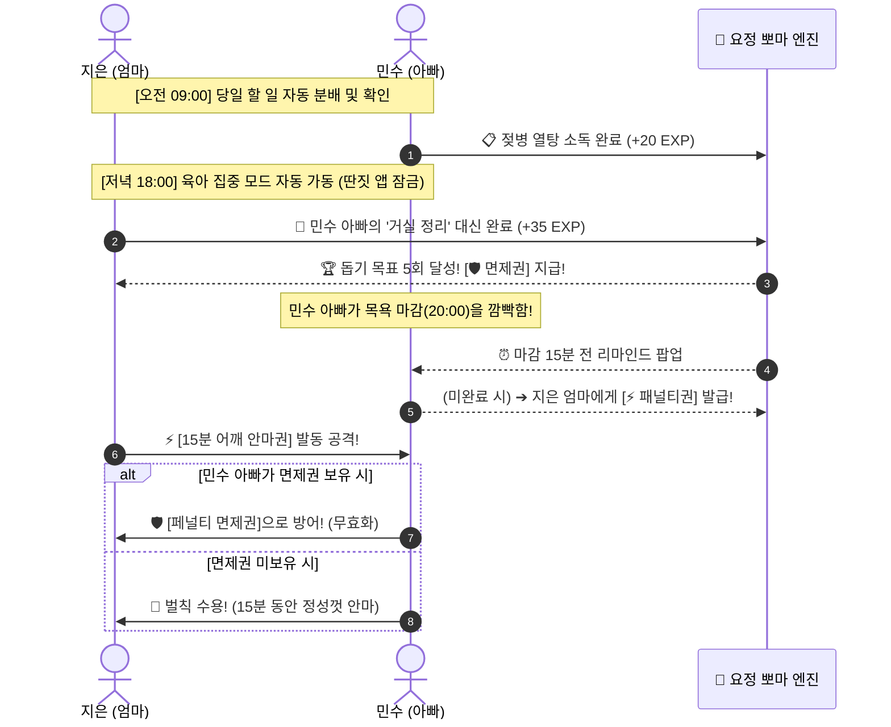

# 📖 [부부 평화 육아 룰북] WeParent 공식 플레이 가이드

> **문서 상태**: Living Spec (공식 부부 협약 룰북)  
> **적용 표준**: Rulebook-Writing Standard v1.0  
> **대상**: 초보 부부 플레이어 및 실사용자  
> **버전**: v1.0 (2026-09-24)

---

## 🧸 1. 개요 및 세계관 (Overview & Goal)

* **게임 테마**: 부부 공동 육아 & 스트레스 제로 게이미피케이션 협동 배틀
* **플레이어 인원**: 2인 (엄마 & 아빠)
* **플레이 주기**: 매일 (Daily 24-Hour Cycle)
* **최종 승리 목표**: 서로에게 잔소리 대신 게임 룰을 통해 행복하고 평화로운 육아 퇴근을 달성하고, 아기 요정 **'뽀마(Bboma)'**를 최고 레벨로 성장시키는 것!

---

## 🗂️ 2. 구성 요소 (Components)

| 구성 요소 | 형태 | 수량 / 초기값 | 역할 및 설명 |
|---|---|:---:|---|
| **📋 일일 퀘스트 (Tasks)** | 가사/육아 할 일 카드 | 일일 4~6개 | 부부가 하루 동안 나누어 수행해야 할 필수 육아 과업 |
| **⚡ 패널티권 (Penalty Cards)** | 벌칙 쿠폰 인벤토리 | 초기 각 1장씩 | 마감 시간 초과 시 상대방에게 발동하는 재미있는 벌칙 카드 |
| **🛡️ 페널티 면제권 (Defense Shield)** | 방어 인벤토리 | 퀘스트 달성 시 획득 | 상대방의 패널티 공격을 1회 완벽히 무효화하는 황금 방패 |
| **👼 요정 뽀마 (Fairy Bboma)** | 마스코트 캐릭터 | 1체 (공동 육성) | 부부의 협동과 과업 수행에 따라 경험치(EXP)를 먹고 성장 |
| **🔔 스마트 알림 센터** | 상단 상태바 & 히스토리 | 실시간 갱신 | 상대방의 모든 할 일 변경, 돕기, 공격, 방어 이력을 기록 |

---

## ⚙️ 3. 시작 준비 (Game Setup)

앱을 처음 시작할 때 부부는 다음 3단계를 함께 상의하여 설정합니다.

1. **초기 면제권 퀘스트 목표 설정**:
   * 상대방 가사를 대신 도와주는 **'천사 배우자' 횟수 목표**를 정합니다. (`5회` 권장 / `10회` 챌린지)
   * 목표 달성 시 **[🛡️ 페널티 1회 방어 면제권]**이 자동 지급됩니다.
2. **육아 집중 시간 (Focus Time) 및 차단 앱 합의**:
   * 매일 저녁 집중 모드 시간(예: `18:00 ~ 21:00`)과 이 시간 동안 잠글 딴짓 앱(유튜브, 인스타그램, 웹툰 등)을 등록합니다.
3. **기본 패널티권 목록 커스텀**:
   * 기본 제공 패널티 외에 서로가 지키기 원하는 벌칙을 추가/수정합니다.
   * *선택이 막막할 땐 **[🤖 뽀마 AI 맞춤 추천]** 버튼을 눌러 활성 할 일과 연계된 카드를 1초 만에 지급받으세요!*

---

## 📚 4. 핵심 용어집 (Terminology Glossary)

| 용어 | 정의 | 주의할 점 |
|---|---|---|
| **육아 집중 모드 (Focus Mode)** | 설정된 시간 동안 스마트폰 딴짓 앱이 잠기고 아이에게 집중하는 시간 | 비상 전화/메신저/필수 앱은 항상 허용 |
| **천사 배우자 (Angel Helper)** | 상대방 담당의 할 일을 내가 대신 완료해 주는 협동 액션 | 수행 시 **+35 EXP** 획득 및 면제권 스택 1 증가 |
| **마감 초과 (Overdue)** | 할 일 마감 시간이 지났으나 완료되지 않은 상태 | 이지 모드: 30분 연장 가능 / 하드 모드: 즉시 패널티 발동 |
| **패널티 발동 (Attack)** | 보유한 패널티권을 사용하여 상대방에게 벌칙을 집행하는 액션 | 집행 즉시 상대방 스마트폰에 긴급 알림 전송 |
| **쉴드 방어 (Defense)** | 면제권을 소모하여 상대방의 패널티 공격을 0으로 상쇄하는 액션 | 방어 성공 시 상대방 패널티권은 소멸됨 |

---

## 🔄 5. 하루의 게임 루프 (Daily Game Loop)

---

## ⚔️ 6. 액션 및 상세 규칙 (Actions & Rules)

### 규칙 1: 할 일 완료 및 협동 돕기
1. **완벽 완료 및 세부 체크리스트**:
   * 할 일에 포함된 세부 항목(예: 목욕물 맞추기, 머리 말리기, 잠옷 입히기 등)을 모두 체크하고 완료하면 **+20 EXP**를 획득하며 완벽 완료 알림이 전송됩니다.
   * **미완료 체크리스트 제출 (양심 패스)**:
     * 미체크 항목이 남은 상태에서 완료를 누르면 경고 팝업이 뜨며, **[그냥 넘기기]**를 선택할 경우 배우자에게 *"⚠️ [머리 말리기]를 빼먹었습니다!"* 알림이 전송됩니다. (+10 EXP)
2. **천사 배우자 돕기 (`[👼 대신 돕기]` 버튼)**:
   * 피곤해하는 배우자의 할 일을 내가 대신해 주면 **+35 EXP** 보너스와 함께 **면제권 획득 스택**이 1 쌓입니다.
3. **가벼운 제스처 핑 (`[👉 제스처]` 버튼)**:
   * 상대방이 미흡하게 넘겼거나 지연될 때 감정 상하지 않게 **⚠️ 주의 주기 / ⏰ 재촉하기 / 💖 폭풍 칭찬** 3종 제스처를 실시간으로 보낼 수 있습니다.
4. **상대방 과업 체크 금지 (권한 분리 원칙)**:
   * 상대방 담당의 할 일 및 세부 체크리스트는 **자물쇠(🔒)**로 잠겨 있어 임의로 완료 체크를 누를 수 없습니다.
   * 상대방 과업에 대해 내가 할 수 있는 행동은 **[👉 제스처 보내기]**와 **[👼 대신 돕기]**뿐입니다.

### 규칙 2: 패널티권 획득 및 발동
1. **획득 조건**:
   * 상대방이 할 일 마감 시간을 초과(Overdue)했을 때 피해 배우자에게 패널티권 1장이 즉시 지급됩니다.
2. **발동 규칙**:
   * 인벤토리에서 원하는 패널티를 선택하고 `[⚡ 페널티 사용]`을 누릅니다.
   * 공격을 받은 상대방 화면에는 팝업이 뜨며, **[🛡️ 면제권으로 방어하기]** 또는 **[🫡 쿨하게 수용하기]** 중 하나를 선택해야 합니다.

### 규칙 4: 캘린더 네비게이션 및 고정 루틴 vs 그때그때 1회성 할 일
1. **매일 고정 루틴 (Daily Routine)**:
   * 목욕, 설거지, 기저귀 분리수거 등 매일 반복되는 과업은 [매일 고정 루틴]으로 등록해 두면 매일 아침 자동으로 캘린더에 생성됩니다.
   * 요일별 설정(평일 전용, 주말 전용 등)을 통해 특정 요일에만 수행하는 루틴을 지정할 수 있습니다.
2. **그때그때 1회성 할 일 (One-Time Task)**:
   * 병원 예방접종, 카시트 세탁, 정기검진 등 특정 일자에만 필요한 일은 [그때그때 1회성]으로 날짜를 지정하여 등록합니다.
   * 상단 주간 캘린더에서 해당 날짜를 터치하면 그날의 루틴과 단발성 과업을 한눈에 확인할 수 있습니다.

### 규칙 5: 내 할 일 우선 단독 뷰 & 상대방 할 일 전환 확인
1. **내 할 일 단독 노출 (기본 모드)**:
   * 지은의 스마트폰에는 지은의 할 일만, 민수의 스마트폰에는 민수의 할 일만 단독으로 표시되어 각자의 과업에 집중할 수 있습니다.
2. **선택적 상대방 할 일 전환 (확인 & 돕기)**:
   * 상단의 `[상대방 할 일 보기]` 탭을 누르면 화면이 배우자의 과업 화면으로 전환되어 상대방의 진행 상황을 확인하고 제스처를 보내거나 대신 도와줄 수 있습니다.
   * `[내 할 일로 ↩]` 버튼을 누르면 언제든 즉시 내 과업 목록으로 복귀합니다.

### 규칙 6: 패널티 수정 및 실시간 알림
* 부부 중 한 명이 패널티권을 추가, 수정, 삭제하거나 할 일을 변경하면 **1초 이내에 상대방 스마트폰으로 알림**이 전송됩니다.
* 상단 상태바의 **🔔 종 아이콘(미확인 개수 뱃지)**을 터치하여 지나간 모든 알림 내역을 조회할 수 있습니다.

### 규칙 7: 어플 제공 공식 협력 퀘스트 & 부부 맞춤 보상 커스터마이징
1. **공식 퀘스트 라인업 제공**:
   * 협력 퀘스트는 사용자가 수동으로 만드는 것이 아니라, **앱 시스템이 자동으로 감지/측정할 수 있는 4대 공식 퀘스트**로 제공됩니다.
   * `📵 주간 노폰 집중 20시간 달성`: 집중 모드 타이머 완료 시 노폰 육아 시간이 누적되어 20시간 도달 시 데이트/외식 쿠폰 지급!
   * `👼 천사 배우자 (상대 가사 돕기)`: `[대신 돕기]` 수행 시 실시간 자동 카운트되어 합의된 횟수(3/5/10회) 도달 시 방어권 지급!
   * `🔥 7일 연속 일일 루틴 완주`: 부부 모두 당일 고정 루틴 100% 완료 시 연속 일수 자동 누적!
   * `✨ 꼼꼼 육아왕 (체크리스트 완벽 10회)`: 세부 체크리스트 누락 없이 완벽 완료 시 자동 카운트!
2. **부부 맞춤 실물/약속 보상 추가 (Custom Reward)**:
   * 기본 면제권/경험치 외에 **`🍗 육퇴 후 치맥 파티`**, **`🏨 주말 호캉스`**, **`☕ 3시간 자유시간`**, **`🛍️ 쇼핑지원금`** 등 원하는 보상을 자유롭게 등록할 수 있습니다.
3. **보상 수령 대상 원칙**:
   * 협력 퀘스트는 부부 공동의 노력이므로 기본적으로 **`👥 부부 함께(둘 다)`** 보상을 받으며, 필요 시 **`👩 엄마`** 또는 **`👨 아빠`**에게 선물로 지정할 수도 있습니다.
4. **수동 조작 배제 및 100% 자동 집계**:
   * 퀘스트에는 수동 진행 버튼이 없으며, 실제 앱 내 육아 활동 이벤트가 발생할 때마다 시스템이 실시간으로 감지하여 보상을 자동 지급합니다.

---

## ⚖️ 8. 부부 평화 분쟁 조정 특수 룰 (Conflict Resolution)

1. **불가항력 예외 조항 (Force Majeure)**:
   * 야근, 아기 급성 발열, 긴급 집안일 등으로 마감을 지키지 못한 경우, 벌칙 발동 대신 **[🤝 30분 긴급 연장]** 또는 **[💖 이번만 용서하기]**를 눌러 평화롭게 넘어갑니다.
2. **패널티 중복 사용 금지 (Cool-down)**:
   * 동일한 패널티권은 하루 최대 2회까지만 발동 가능하며, 상대방이 수행 중일 때는 추가 공격을 할 수 없습니다.
3. **감정 격화 방지 쿨타임**:
   * 패널티 공격을 주고받은 후에는 뽀마가 *"오늘도 서로 고생 많았어요! 따뜻한 말 한마디 건네보세요 💕"* 응원 팝업을 띄웁니다.

---

## 📌 9. 부록: 1-Page 빠른 참조표 (Quick Reference)

| 상황 | 나의 액션 | 시스템 피드백 & 보상 |
|---|---|---|
| **오늘 내 할 일을 꼼꼼히 끝냈을 때** | 체크박스 `[✓]` 클릭 | 뽀마 +20 EXP, 배우자에게 완벽 완료 알림, 꼼꼼 퀘스트 자동 +1 |
| **체크리스트를 덜 끝내고 넘길 때** | 1차 경고 후 `[그냥 넘기기]` | 뽀마 +10 EXP, **배우자에게 누락 항목 알림** |
| **지친 배우자의 할 일을 대신해 줄 때** | `[👼 대신 돕기]` 클릭 | 뽀마 +35 EXP, **천사 배우자 퀘스트 자동 +1** |
| **스마트폰을 내려놓고 25분 집중했을 때** | `[👶 집중 모드]` 완주 | 뽀마 +50 EXP, **주간 노폰 집중 시간 +0.5h 자동 누적** |
| **상대방에게 가볍게 챙김/응원 보낼 때** | `[👉 제스처]` 클릭 | **⚠️주의 / ⏰재촉 / 💕칭찬** 팝업 전송 |
| **천사 배우자 목표(5회) 또는 노폰 20h 완주 시** | 시스템 자동 감지 | **🛡️ 페널티 1회 방어 면제권 / ☕ 외식 쿠폰 자동 지급** |
| **상대방이 마감을 어겼을 때** | `[⚡ 패널티 발동]` 클릭 | 상대방 화면에 벌칙 집행 팝업 |
| **상대방이 나에게 패널티를 썼을 때** | `[🛡️ 방어]` 또는 `[🫡 수용]` | 방어 시 무효화 / 수용 시 벌칙 수행 |
| **상대방이 룰/할 일을 수정했을 때** | 상단 **🔔 종 아이콘** 터치 | 알림 센터에서 변경 내역 실시간 확인 |
