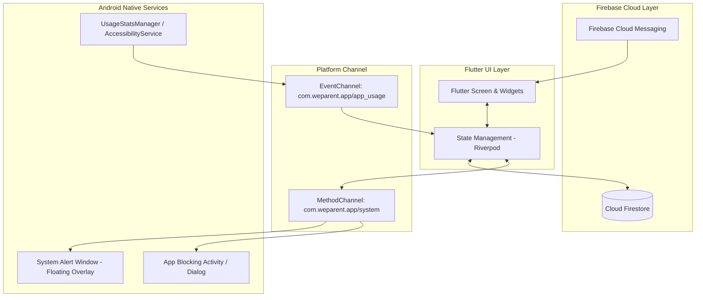

# 📱 [네이티브 구현 설계서] Flutter + Android Native 연동 마스터 플랜

> **문서 상태**: Living Spec (네이티브 구현 가이드)  
> **대상 플랫폼**: Android 10+ (API Level 29~34) / Flutter 3.x  
> **최종 갱신일**: 2026-09-24

---

## 🏗️ 1. 시스템 아키텍처 개요

프로토타입에서 검증된 UI/UX 및 게이미피케이션 로직을 Android 네이티브 시스템 제어 기능과 완벽히 결합합니다.



---

## 🔌 2. Flutter Platform Channel 인터페이스 규격

### 2.1 MethodChannel (`com.weparent.app/system`)

| 메서드명 (`method`) | 파라미터 (`arguments`) | 반환값 | 설명 |
|---|---|---|---|
| `startFocusMode` | `{ "endTime": 1727182800000, "blockedPackages": ["com.google.android.youtube", ...] }` | `bool` | 네이티브 백그라운드 집중 모드 및 앱 모니터링 가동 |
| `stopFocusMode` | `{}` | `bool` | 집중 모드 해제 및 백그라운드 모니터링 중단 |
| `checkPermissions` | `{}` | `Map<String, bool>` | 필수 권한(USAGE_STATS, OVERLAY, NOTIFICATION) 허용 여부 점검 |
| `requestPermission` | `{ "permissionType": "USAGE_STATS" \| "OVERLAY" }` | `void` | 해당 시스템 설정 화면으로 Intent 이동 |
| `showFloatingBadge` | `{ "message": "육아 집중 시간입니다!", "currentTask": "아기 목욕" }` | `bool` | 스마트폰 화면 상단 플로팅 오버레이 잔소리 뱃지 표출 |
| `hideFloatingBadge` | `{}` | `bool` | 플로팅 오버레이 닫기 |

### 2.2 EventChannel (`com.weparent.app/app_usage`)

* **역할**: 안드로이드 네이티브 서비스에서 감지된 딴짓 앱 실행 이벤트를 Flutter 레이어로 실시간 스트리밍.
* **이벤트 페이로드**:
  ```json
  {
    "eventType": "BLOCKED_APP_DETECTED",
    "packageName": "com.google.android.youtube",
    "appName": "YouTube",
    "timestamp": 1727182800000
  }
  ```

---

## 🛡️ 3. Android Native 핵심 컴포넌트 설계

### 3.1 딴짓 앱 감지 엔진 (`AppMonitoringService`)
* **방식**: `UsageStatsManager` (폴링 주기 1초) + 보조 `AccessibilityService`.
* **동작**: 현재 Foreground에 위치한 앱의 Package Name이 `blockedPackages`에 포함되어 있을 경우:
  1. 즉시 `WeParent Lock Screen Activity`를 `FLAG_ACTIVITY_NEW_TASK`로 최상단에 띄움.
  2. 홈 화면(`Intent.ACTION_MAIN, Intent.CATEGORY_HOME`)으로 강제 이동.
  3. 플로팅 잔소리 뱃지에 *"지금은 아이에게 집중할 시간이에요! 👼"* 메시지 출력.

### 3.2 최상단 플로팅 잔소리 오버레이 (`FloatingNagOverlayService`)
* **권한**: `android.permission.SYSTEM_ALERT_WINDOW`
* **Window Type**: `WindowManager.LayoutParams.TYPE_APPLICATION_OVERLAY`
* **특징**:
  * 드래그 가능한 작은 뽀마 요정 아이콘.
  * 터치 시 현재 남은 육아 집중 시간 및 담당 할 일 카드 툴팁 표시.
  * 백그라운드 터치 패스스루(`FLAG_NOT_FOCUSABLE | FLAG_NOT_TOUCH_MODAL`) 지원.

---

## 📁 4. Flutter 프로젝트 구조 (Clean Architecture)

```
lib/
├── main.dart                          # 앱 엔트리포인트 & Firebase 초기화
├── core/
│   ├── constants/                     # 앱 테마, 색상, 애니메이션 토큰
│   ├── network/                       # Firebase & FCM 클라이언트
│   └── native/                        # MethodChannel 래퍼 클래스
├── data/
│   ├── models/                        # TaskModel, PenaltyModel, UserModel
│   ├── datasources/                   # Firestore Remote DataSource
│   └── repositories/                  # TaskRepository, PenaltyRepository
├── domain/
│   ├── entities/                      # 비즈니스 도메인 엔티티
│   └── usecases/                      # CompleteTask, TriggerPenalty, DefendPenalty
└── presentation/
    ├── providers/                     # Riverpod State Notifiers
    ├── screens/
    │   ├── splash_screen.dart         # 온보딩 & 룰북 시작 화면
    │   ├── couple_dashboard_screen.dart # 메인 2인 분할 대시보드
    │   ├── task_manage_screen.dart    # 할 일 CRUD & 6대 프리셋 모달
    │   ├── penalty_inventory_screen.dart # 패널티 CRUD & AI 맞춤 추천
    │   └── notification_center_screen.dart # 🔔 알림 센터 & 히스토리
    └── widgets/
        ├── fairy_bboma_widget.dart    # 뽀마 캐릭터 애니메이션
        └── focus_timer_dial.dart      # 집중 타이머 휠 다이얼
```

---

## 🚀 5. 단계별 개발 마일스톤 (Phase Roadmap)

1. **Step 1: Flutter 프로젝트 생성 & 디자인 시스템 구축**
   * 프로젝트 베이스라인 세팅, 폰트(Pretendard), 테마 컬러(`indigo`, `amber`, `rose`) 및 공통 위젯 이식.
2. **Step 2: Firestore & FCM 실시간 연동**
   * 부부 방 페어링, 실시간 할 일/패널티 CRUD 및 푸시 알림 리액티브 스트림 구축.
3. **Step 3: Android Native MethodChannel & 서비스 구현**
   * Kotlin 기반 `AccessibilityService` & `UsageStatsManager` 앱 감지 엔진 완성.
   * `SYSTEM_ALERT_WINDOW` 기반 플로팅 뽀마 오버레이 뷰 탑재.
4. **Step 4: 온보딩 영상 & 공식 룰북 탑재**
   * 사용자가 제작한 프롤로그 애니메이션 동영상 플레이어 연동 및 [부부 평화 육아 룰북](file:///E:/%EA%B0%9C%EB%B0%9C/%EB%BD%80%EB%A7%88%ED%82%A4%EC%A6%88/docs/specs/couple-rulebook.md) 메뉴 통합.
