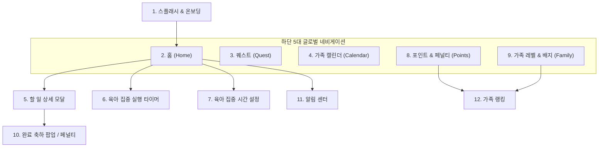

# 🎨 뽀마키즈(PPOMAKIDS) UI/UX 레이아웃 설계 규격서

> **문서 상태**: Living Spec (SSOT)  
> **기준 레퍼런스**: `C:\Users\cyg12\OneDrive\바탕 화면\추천이미지.png`  
> **적용 타깃**: Flutter 앱 (Android / iOS) & Capacitor 하이브리드 플랫폼

---

## 1. 개요 및 디자인 시스템 (Design System Tokens)

본 문서는 추천 디자인 시안(`추천이미지.png`)의 12개 주요 화면과 7대 핵심 기능 모듈을 기반으로 재구성한 **뽀마키즈의 통합 레이아웃 및 화면 설계 표준**입니다.

### 1.1 브랜드 & 비주얼 아이덴티티
* **브랜드명**: 뽀마키즈 (PPOMAKIDS / WeParent)
* **슬로건**: *"함께 키우는 오늘, 우리가족의 육아 RPG!"* / *"오늘도, 뽀마키즈와 함께해요!"*
* **마스코트 캐릭터**: **뽀마 (Bboma)** - 몽실몽실한 흰 구름/병아리 형태의 감성 육아 요정. 상황별 다양한 표정(환호, 응원, 잠자기, 땀 흘리기, '사실 배부른 척 하는 중' 등)으로 즉각적인 피드백 제공.
* **디자인 테마 시스템**: **듀얼 테마 (화이트 기본 + 미드나잇 다크)**
  * **화이트 테마 (White Theme - 공식 기본값)**: 토스(Toss) 및 애플(Apple) 스타일의 눈이 가장 편안한 소프트 라이트 그레이(`F2F4F6`) 바탕 + 퓨어 화이트(`#FFFFFF`) 카드 + 미세 보더(`#E5E8EB`) + 딥 옵시디언 다크(`191F28`) 폰트로 장시간 사용 시 눈의 피로를 최소화하고 압도적인 가독성 제공.
  * **미드나잇 다크 글래스모피즘 (Navy Theme - 보조 모드)**: 야간 수유나 재우기 시간 암실 환경에서 눈부심을 차단하는 딥 네이비(`090E1D`~`0D1527`) 글래스모피즘 룩 제공.

### 1.2 컬러 팔레트 (Color Palette - 화이트 테마 기준)
| 구분 | 컬러 코드 | 용도 및 시각적 특징 |
| :--- | :--- | :--- |
| **Background (기본)** | `#F2F4F6` | 전체 앱 배경, 눈이 가장 편안한 토스 표준 소프트 라이트 그레이 |
| **Card / Surface (표면)** | `#FFFFFF` | 퓨어 화이트 카드, 1px 보더 (`#E5E8EB`), 소프트 섀도우 (`rgba(15, 23, 42, 0.05)`) |
| **Sub Surface (보조 표면)** | `#F8FAFC` | 서브 리스트, 체크리스트, 중첩 박스, 퀘스트 내부 카드 |
| **Text Primary (주요 본문)** | `#191F28` | 가장 또렷한 딥 옵시디언 다크, 타이틀 및 메인 텍스트 |
| **Text Secondary (보조 본문)** | `#4E5968` | 편안한 웜 슬레이트, 부제목 및 설명문 |
| **Text Caption (캡션/보조)** | `#8B95A1` | 은은한 뉴트럴 그레이, 날짜, 서브 메타 정보 |
| **Primary Accent (토스 블루)** | `#3182F6` ~ `#1D4ED8` | 대표 CTA 버튼, 집중 모드, 활성 탭 인디케이터 |
| **Spouse Action (대신 돕기)** | `#EFF6FF` / `#1D4ED8` | 상대방 과업 대신 돕기 전용 고대비 파스텔 블루 알약 버튼 |
| **Success Emerald (완료 체크)**| `#ECFDF5` / `#047857` | 할 일 완료 뱃지, 스와이프 완료 체크 서클 (`#10B981`) |
| **Point Gold (보상/코인)** | `#FEF3C7` / `#92400E` | 포인트(+P), 코인, 뽀마 경험치 바, 치킨 저금통 |
| **Pink / Rose (엄마/사랑)** | `#FDF2F8` / `#BE185D` | 엄마 프로필, 엄마 퀘스트 태그, 응원 하트 |
| **Penalty Red (경고/차감)** | `#FEF2F2` / `#DC2626` | 페널티 알림, 경고 알림, 긴급 집중 종료 |

### 1.3 공통 컴포넌트 규격
* **모서리 반경 (Radius)**: 메인 카드/컨테이너 `rounded-2xl`(16px) ~ `rounded-3xl`(24px), 칩/버튼 `rounded-full` (Pill shape), 모달 `rounded-[32px]`
* **상단 헤더 높이**: 56px (Safe Area Inset 제외), 좌측 뽀마 로고, 우측 테마 토글(☀️/🌙), 알림 벨, 프로필
* **하단 네비게이션 높이**: 64px + Safe Area Bottom, 화이트 바탕(`FFFFFF`), 상단 미세 라인(`E5E8EB`), 5개 고정 탭 메뉴

---

## 2. 전체 네비게이션 구조 및 화면 맵 (Information Architecture)

---

## 3. 화면별(12개 화면) 상세 레이아웃 설계

### [화면 1] 스플래시 & 온보딩 화면 (Splash & Onboarding)
* **화면 목적**: 신규 진입 시 세계관 전달 및 즉각적인 서비스 시작
* **상단 영역**:
  * OS 상태바 (9:41)
  * 브랜드 로고: 골드 왕관 심볼 + 굵은 화이트 텍스트 **"뽀마키즈"**
  * 서브 카피: *"함께 키우는 오늘, 우리가족의 육아 RPG!"*
* **중앙 비주얼 영역**:
  * 밤하늘 위 동화풍 성(Castle)과 빛나는 별무리
  * 성을 바라보는 부부와 아기, 그 사이를 떠다니는 구름 마스코트 뽀마 일러스트
* **하단 액션 영역**:
  * 메인 CTA: 풀 와이드 블루 그라데이션 버튼 `시작하기 →` (높이 54px, `rounded-2xl`)
  * 서브 텍스트: `로그인` 링크 텍스트 버튼

---

### [화면 2] 홈 메인 대시보드 (Home Dashboard)
* **화면 목적**: 부부 육아 현황과 오늘의 할 일을 직관적으로 관리하는 메인 관제 센터
* **상단 헤더 (App Bar)**:
  * 좌측: 뽀마 마스코트 아이콘 + 로고 타이포 `뽀마키즈`
  * 우측: 테마 전환 원터치 아이콘(☀️ 화이트 / 🌙 네이비), 알림 벨 아이콘 (안 읽은 알림 레드 뱃지), 가족 프로필 아바타
* **컴포넌트 1: 가족 레벨 카드 (Family Level Hero Card)**:
  * 스타일: 퓨어 화이트 카드 (`#FFFFFF`), 미세 보더 (`#E5E8EB`), 소프트 섀도우
  * 좌측: 3D 뽀마 캐릭터 + 골드 왕관 뱃지
  * 중앙/우측: "우리 가족 · Lv.3" 딥 옵시디언 다크(`191F28`) 텍스트, 골드 경험치 게이지 바 (`120/200 EXP`)
* **컴포넌트 2: 오늘의 공동 퀘스트 카드 (Today's Co-op Quest)**:
  * 태그 칩: 🏆 `오늘의 공동 퀘스트` (토스 블루 파스텔 칩)
  * 타이틀: **"우리 아이, 건강하게 자라기!"** (`16px`, 볼드, `#191F28`)
  * 서브설명: *"고른 영양만점 식단과 충분한 수면으로 건강한 하루를 만들어주세요."*
  * 진행률 및 보상: 프로그레스 바 (`2/4` 완료) + 골드 뱃지 `+50P`
* **컴포넌트 3: 오늘의 할 일 섹션 (Today's Tasks & Swipe-to-Complete)**:
  * 섹션 타이틀: **"오늘의 할 일"** (`18px`, 볼드, `#191F28`)
  * 필터 세그먼트 (Pill Tab): `전체` | `엄마` | `아빠` (또는 `내 할 일` | `배우자 할 일`)
  * **리스트 정렬 규칙**: ① 내 미완료 → ② 배우자 미완료 → ③ 내 완료 → ④ 배우자 완료 (같은 그룹 안에서는 등록 순서 유지)
  * **밀어서 완료 (Swipe-to-Complete) 마이크로 인터랙션**:
    * 내 담당 과업 카드: 좌측 스와이프 제스처 지원.
    * 안내 텍스트: 카드 우측에 순수 텍스트 형태의 `밀어서 완료 ‹` 유도문구 표출 (버튼 형태 배제).
    * **1회성 튜토리얼 소멸 규칙**: 사용자가 최초 1회 스와이프 완료를 성공하면 `STATE.hasCompletedSwipeTutorial = true` (`localStorage`) 처리되어 이후 텍스트가 영구 소멸되고 원형 체크 버튼(`✓`)만 심플하게 유지.
    * 스와이프 모션: 좌측으로 50px 이상 드래그 시 초록색 완료 배경과 체크 아이콘이 부드럽게 노출되며 완료 세레모니 발동.
  * **배우자 과업 전용 액션 버튼 (`[🤝 대신 돕기]`)**:
    * 배우자 담당 과업 카드는 체크박스가 잠금(🔒) 처리되고, 대신 우측에 **고대비 파스텔 블루 알약 버튼 (`theme-help-spouse-btn`, 배경 `#EFF6FF`, 텍스트 `#1D4ED8`)** 표출.
    * 클릭 시 즉시 대신 완료 처리되며 상대방에게 감사 푸시 및 `천사 배우자` 퀘스트 카운트 적립.
  * **쇼핑 연계 칩**: 식자재/생필품성 과업 감지 시 제목 옆에 **`[🛒 쿠팡 2% 적립]`** 태그 노출.
* **컴포넌트 4: 쿠팡 생필품 직결 검색 인라인 카드**:
  * 키즈노트형 2% 저금통 적립 인라인 검색 카드: 인풋 필드 + 우측 `[검색 ➔]` 버튼 완전 캡슐화 + 핫딜 퀵태그(`🍼 기저귀`, `🧴 젖병세제`, `🧻 물티슈`, `🥗 이유식`).
* **컴포넌트 5: 뱅크샐러드형 스마트 넛지 배너**:
  * 시간대별 뽀마의 스마트 잔소리/조언 배너 (미완료 과업 챙기기, 노폰 집중 독려 등).
* **하단 글로벌 네비게이션**: 5개 탭 (`홈` 선택 활성화, 화이트 바, 상단 라인 `#E5E8EB`)

---

### [화면 3] 퀘스트 센터 (Quest Center)
* **화면 목적**: 가족 공동 퀘스트 및 부부 각자의 미션 도전과 진행도 확인
* **상단 헤더**: `← 퀘스트`, 우측 필터/설정 아이콘
* **토스 미션형 상단 카운터 & 마스코트**:
  * 대형 카운터 텍스트: **"오늘 남은 미션 5개/5"** (`20px`, 볼드, `#191F28`)
  * 3D 뽀마 병아리 마스코트 + 토스형 반응형 말풍선: *"사실 배부른 척 하는 중 🐣"*
* **카테고리 필터 탭 (Pill Filter)**: `전체` | `육아` | `일상` | `이벤트`
* **광고형 퀘스트 배너 캐러셀 (Swipe Banner Carousel)**: 필터 탭 바로 아래 배치
  * 카드 폭 화면의 약 84%, 비율 약 1.56:1, `rounded-3xl`. 좌우 인접 카드가 살짝 보이며(축소 0.93 + 반투명), `scroll-snap`으로 한 장씩 부드럽게 넘어감.
  * 카드가 넘어갈 때마다 가벼운 햅틱(`triggerHaptic('light')`, Capacitor Haptics → `navigator.vibrate` 폴백).
  * 카드 정보(필요 최소한): 강조 문구(`N건 남음` / `🎉 달성 완료!`, 퀘스트 액센트 색) · 짧은 제목 + `+포인트` (17px 볼드) · 🎁 맞춤 보상 1줄 · 진행 수치 + 얇은 게이지 · 우측 대형 아이콘 · 우하단 `n | 전체` 카운터.
  * 배경: 화이트 테마는 퀘스트별 파스텔 그라데이션, 네이비 테마는 액센트 틴트 다크 그라데이션. 카드 탭 시 맞춤 보상 모달 오픈.
* **라운드 화이트 컨테이너 (`#FFFFFF`, `rounded-3xl`) 내 소프트 그레이 서브 카드 (`#F8FAFC`, `rounded-2xl`)**:
  * 퀘스트 1: **📵 주간 노폰 집중 20시간 달성**
    * 도톰한 8px 비비드 게이지 바 (`12.5h / 20.0h`, 토스 블루 `#3182F6`)
    * 보상: `🍗 육퇴 후 최애 치맥 파티 (부부 공동)` + `+50P`
  * 퀘스트 2: **👼 천사 배우자 (상대 가사 5회 돕기)**
    * 도톰한 에메랄드 게이지 바 (`3 / 5회`, `#10B981`)
    * 보상: `☕ 3시간 온전한 자유시간권` + `+30P`
  * 퀘스트 3: **🔥 7일 연속 일일 루틴 완주**
    * 도톰한 오렌지 게이지 바 (`5 / 7일`, `#F59E0B`)
    * 보상: `🏨 주말 1박 힐링 호캉스` + `+50P`
  * 퀘스트 4: **✨ 꼼꼼 육아왕 (체크리스트 완벽 10회)**
    * 도톰한 퍼플 게이지 바 (`7 / 10회`, `#8B5CF6`)
    * 보상: `🍰 최애 디저트 & 커피 쏘기` + `+30P`
* **광고 2배 부스터**: 퀘스트 완주 시 `[📺 15초 광고 보고 2배 받기]` 버튼 제공.

---

### [화면 4] 가족 캘린더 (Family Calendar)
* **화면 목적**: 가족의 일별 육아 일정과 타임라인을 한눈에 파악
* **상단 헤더**: 📅 아이콘 + `가족 캘린더`, 우측 일정 추가(`+`) 아이콘
* **컴포넌트 1: 월 선택 & 주간 캘린더 바**:
  * `< 2026년 9월 >` 월 네비게이터
  * 요일 헤더: `월   화   수   목   금   토   일`
  * 날짜 칩: `20   21   22   [23(파란 원 강조/오늘)]   24   25   26` (상태 도트: 노란색=오늘, 초록색=1회성 과업 존재)
* **컴포넌트 2: 오늘의 일정 타임라인 (Today's Timeline)**:
  * 08:30: 🎒 **아이 등원** (어린이집) `>`
  * 12:30: 🍱 **점심 식사** (집) `>`
  * 14:00: 🌙 **낮잠** (집) `>`
  * 18:00: 💼 **아빠 퇴근** (회사) `>`
  * 19:00: 🍽️ **저녁 식사** (집) `>`

---

### [화면 5] 할 일 상세 뷰 / 모달 (Task Detail View)
* **화면 목적**: 개별 할 일의 상태 확인, 세부 체크리스트 점검, 원터치 완료, 부부 응원 코멘트 교환
* **상단 헤더**: `← 할 일 상세`
* **컴포넌트 1: 메인 태스크 카드**:
  * 상단: 프로필 아바타 + **"아침 식사 챙기기"** + `08:00 · 엄마` 태그
  * 중앙: **세부 체크리스트(Sub-Checklist)** 4개 점검 항목
  * 하단 액션 버튼: 커다란 블루 풀버튼 `✔ 완료하기`
* **컴포넌트 2: 보상 안내 카드**:
  * `⭐ 보상` 헤더 + 골드 코인 아이콘 + **`+20P`** (성공 시 포인트 및 EXP가 지급됩니다.)
* **컴포넌트 3: 부부 응원 메시지 / 톡 (Cheering Talk)**:
  * 엄마 말풍선: 👩 엄마 *"오늘도 맛있게 먹자! 🍲"*
  * 아빠 말풍선: 👨 아빠 *"우리 꼬, 오늘도 잘했어! 👍"*

---

### [화면 6 & 7] 육아 집중 시간 모달 & 네이티브 컨트롤러 (Focus Mode Modal & Media Controls)
* **화면 목적**: 스마트폰 중독을 방지하고 아이와의 집중 육아 시간을 세세하게 설정·실행·제어
* **화면 구조**: 독립 전체화면 또는 바텀시트 모달 (`bg-white rounded-[32px] p-6`)
* **상단 게이지 및 디지털 시계**:
  * 라이트 그레이 서큘러 링 (`#E5E8EB`) + 토스 블루 프로그레스 호
  * 중앙 대형 디지털 시계: **`25:00`** 또는 **`05:00:00`** (시인성 최고 딥 옵시디언 다크 `#191F28`)
* **탭 전환 (Tab Selector)**: `⏱️ 프리셋 집중` vs `🕒 시간대 직접 지정`
* **모드 1: 프리셋 집중 (Preset Mode)**:
  * 4대 고대비 퀵 타일 그리드:
    * `15분` | `25분` (기본 뽀모도로) | `50분` | `60분`
  * 분 미세조정 스텝퍼: `[-10분]`, `[-5분]`, `[+5분]`, `[+10분]`
  * 예상 종료 시각 프리뷰: *"지금 시작 시 약 14:25까지 집중"*
* **모드 2: 시간대 직접 지정 (Custom Range Mode)**:
  * 2열 반응형 그리드 (`grid grid-cols-2 gap-2.5`):
    * 좌측 카드: 🟢 `시작 시간` Time Picker (`13:30`)
    * 우측 카드: 🔴 `종료 시간` Time Picker (`18:30`) (테두리 벗어남 버그 완전 해결)
  * 총 집중 시간 실시간 자동 환산: *"총 5시간 0분 집중"*
  * 4대 상황별 원클릭 퀵 프리셋:
    * ☀️ `낮 집중` (13:30 ~ 18:30) | 🌅 `오전 케어` (09:00 ~ 12:00)
    * 🌙 `저녁 육아` (19:00 ~ 22:00) | 🍼 `심야 케어` (22:00 ~ 02:00)
* **시작 버튼**: 블루 풀와이드 버튼 `👶 육아 집중 시작하기`
* **실행 시 안드로이드 공식 미디어 알림 연동 (`MediaSessionCompat` + `MediaStyle`)**:
  * 상태바: 안드로이드 SystemUI 표준 `ic_stat_bboma` (`👶`) 아이콘 상주 (오버레이 윈도우 일체 없음).
  * 3버튼 미디어 컨트롤러 (Lock Screen & 알림창):
    * `⏸` 일시정지 / `▶` 계속하기
    * `⏩` +5분 연장
    * `✕` 집중 종료

---

### [화면 8] 포인트 & 기프티콘 저금통 (Points & Gifticon Bank)
* **화면 목적**: 부부 공동 기프티콘 저금통, 쿠팡 2% 캐시백, 육퇴 보너스 룰렛 관리
* **컴포넌트 1: 토스 스타일 치킨 저금통 히어로 카드 (Chicken Piggy Bank)**:
  * 스타일: 퓨어 화이트 카드 (`#FFFFFF`), 미세 보더 (`#E5E8EB`), 소프트 섀도우
  * 상단 카피: *"저금할 때마다 / 치킨 조각이 모여요"*
  * 중앙 적립액: **`8,940원`** (`28px`, 볼드, `#191F28`)
  * 그래픽: 실버 트레이 위 황금 통닭 SVG 일러스트 (`🍗`)
  * 잔여 게이지: *"치킨 한 마리(20,000원)까지 11,060원 남았어요!"*
  * 메인 CTA: 비비드 블루 풀와이드 버튼 `[🍗 치킨값 모아보기 →]`
  * 서브 링크: `[내 브랜드콘 보관함 >]`
* **컴포넌트 2: 키즈노트형 쿠팡 제휴 쇼핑 2% 적립 카드**:
  * 헤더: 🛒 **쿠팡 제휴 쇼핑 (결제액 2% 저금통 적립)**
  * 한도 진행 바: `이번 달 적립액: 1,850P / 3,500P` (월 최대 3,500P 한도)
  * 인라인 검색 바: 육아용품/생필품 검색 후 즉시 쿠팡 연결 및 2% 자동 캐시백
* **컴포넌트 3: 10섹터 육퇴 보너스 룰렛 (10-Sector Roulette)**:
  * 1일 3회 시청 제한 및 매일 21:00 (육퇴 시간) 리셋.
  * 10개 부채꼴 슬롯: `1,000P!`, `500P!`, `200P`(2칸), `20P`(3칸), `10P`(3칸) 동적 셔플.
  * 고액 슬롯 비인접 분리 배치 및 정밀 바늘 감속 애니메이션.

---

### [화면 9] 가족 레벨 & 배지 도감 (Family Level & Badges)
* **화면 목적**: 육아 여정의 성장 체감과 RPG 수집/업적 도감 제공
* **컴포넌트 1: 뽀마 진화 및 가족 레벨 카드**:
  * 뽀마 성장 4단계: 알 ➔ 병아리 ➔ 어린이 ➔ 육아 수호왕
  * 가족 프로필 + **"Lv.3"** + 경험치 프로그레스 바 (`120/200 EXP`)
* **컴포넌트 2: 부부 육아 밸런스 비교 리포트**:
  * 주간/월간 엄마 vs 아빠 집중 시간 및 과업 완료 비율 (트윈 바 차트)
  * *"🏅 황금 밸런스 부부"* 칭찬 뱃지 및 감사 카드 전송 버튼
* **컴포넌트 3: 6종 핵심 명예 배지 그리드**:
  * 👑 육아왕 | 💖 가족케미 | 🍀 행복지수 | ⏰ 집중의 달인 | 🍗 치킨 정복자 | 🛡️ 철벽 방어왕

---

## 4. 하단 7대 핵심 기능 모듈 매핑 (Feature Module Mapping)

| 심볼 / 라벨 | 대응 핵심 화면 | 주요 역할 및 기능 |
| :--- | :--- | :--- |
| **📋 할 일 관리** | [화면 2], [화면 5] | 밀어서 완료, 대신 돕기, 세부 체크리스트, 쿠팡 쇼핑 연계, 루틴 vs 1회성 |
| **🏆 공동 퀘스트** | [화면 2], [화면 3] | 100% 자동 집계 공식 4대 퀘스트, 토스 미션 스타일, 광고 2배 부스터 |
| **🍗 치킨 저금통 & 포인트** | [화면 8] | 토스풍 치킨 저금통, 쿠팡 2% 캐시백, 10섹터 보너스 룰렛, 실물 기프티콘 교환 |
| **⏱️ 육아 집중 모드** | [화면 6 & 7] | 프리셋/시간대지정 모달, MediaSession 공식 미디어 노티피케이션, 앱 차단 |
| **📅 가족 캘린더** | [화면 4] | 월간/주간 육아 루틴 타임라인, 등원/식사/낮잠/퇴근 일정 공유 |
| **💡 스마트 넛지** | [화면 2] | 뱅크샐러드형 위트 팩폭 알림 (기저귀, 생필품, 노폰 집중 잔소리) |
| **👑 성장 & 밸런스** | [화면 2], [화면 9] | 뽀마 4단계 진화, 부부 육아 밸런스 트윈 바 리포트, 6종 명예 배지 |

---

## 5. Flutter & Hybrid 구현 적용 가이드

1. **글로벌 5대 탭 표준 구조**:
   - `home`(홈 대시보드), `quest`(뽀마 & 퀘스트), `calendar`(가족 캘린더), `points`(기프티콘 저금통), `family`(가족 레벨 & 밸런스).
   - `focus`(육아 집중 시간)는 홈 상단 또는 퀵 액션을 통해 진입하는 독립 모달 뷰(`FocusModal`)로 연동.
2. **화이트 테마 기본 및 듀얼 테마 아키텍처**:
   - `body.theme-white`를 공식 기본 테마로 채택하고, 야간용 `body.theme-navy`를 지원.
   - 배경 `#F2F4F6`, 카드 `#FFFFFF`, 보더 `#E5E8EB`, 폰트 `#191F28` / `#4E5968` 토큰을 전역 스타일에 주입.
3. **네이티브 미디어 세션 파이프라인**:
   - 강제 오버레이 윈도우(`SYSTEM_ALERT_WINDOW`)를 절대 사용하지 않고, Android 공식 `FocusForegroundService` + `MediaSessionCompat` + `NotificationCompat.MediaStyle`로 3버튼 미디어 컨트롤을 제공.
4. **마스코트 '뽀마' 에셋 통일**:
   - 상황별(행복, 응원, 파티, 배부른 척 🐣, 졸림) 뽀마 일러스트를 홈 레벨 카드, 퀘스트 헤더 말풍선, 완료 세레모니에 일관되게 배치.

